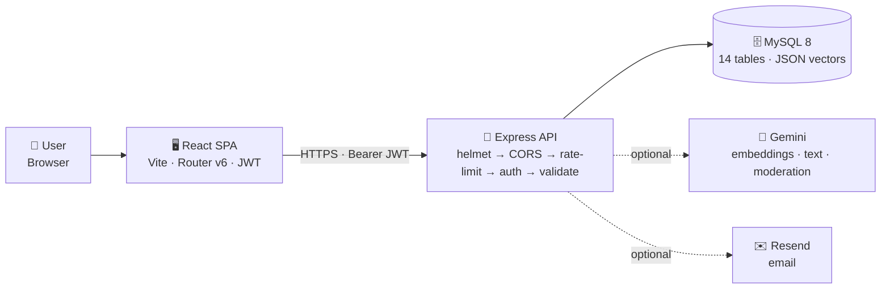

# AI-Powered Evangadi Forum

A full-stack community forum with AI-powered features built on React + Vite (frontend), Express (backend), and MySQL. It combines a classic Q&A experience with semantic search, AI draft coaching, answer-fit scoring, automated content moderation, a community-trust reputation system, an admin moderation panel, a per-document RAG knowledge base, and an in-app changelog.

---

## Table of Contents

- [Features](#features)
- [Tech Stack](#tech-stack)
- [Architecture](#architecture)
- [Project Structure](#project-structure)
- [Environment Variables](#environment-variables)
- [Getting Started](#getting-started)
- [Available Scripts](#available-scripts)
- [Core Features in Detail](#core-features-in-detail)
- [Security Configuration](#security-configuration)
- [API Overview](#api-overview)
- [Team Members](#team-members)

---

## Features

- **Authentication** — register, login (JWT), email confirmation, and password reset (Resend email).
- **Q&A** — ask questions and post answers in threaded discussions with Markdown + code blocks.
- **Semantic search & AI answers** — keyword search plus embedding-based semantic search that also returns a written AI answer grounded in the forum.
- **AI Draft Coach & Answer-Fit** — pre-submit feedback on question drafts and a categorical **fit verdict** (Strong / Medium / Weak / Poor — relevance only) for answer drafts.
- **AI content moderation** — every question and answer is screened before publishing: off-topic posts are rejected with guidance, spam/harassment is flagged for review, with a deterministic keyword fallback when the AI is unavailable.
- **Duplicate & similar-question detection** — warns when you re-post something very similar, and flags repeated near-identical submissions as spam.
- **Community trust** — upvotes, a trust score, badges, monthly + all-time leaderboards, and public user profiles.
- **Admin panel** — moderation queue, flag activity history, and user management (roles, blocks) with role-based access control.
- **RAG knowledge base** — upload PDFs, chunk + embed them, run per-document semantic search, and ask questions answered **only** from that document with inline source references.
- **What's New changelog** — a per-account "What's New" modal with dated, categorized (New / Improved / Fixed) release notes and a navbar bell.

---

## Tech Stack

| Layer | Technology |
|-------|-----------|
| Frontend | React, Vite, React Router v6, Axios, Framer Motion, lucide-react |
| Backend | Node.js, Express 5, express-validator, helmet, express-rate-limit |
| Database | MySQL 8, mysql2/promise |
| Auth | JWT (jsonwebtoken), bcryptjs |
| AI | Google Gemini — `gemini-embedding-001` (embeddings), `gemini-2.5-flash` / `gemini-2.5-flash-lite` (text) |
| Email | Resend |
| File Upload | Multer, pdf-parse (v2 `PDFParse` class API) |

---

## Architecture

A **four-tier** system: a React SPA talks to a **stateless** Express API, which reads/writes MySQL and calls two **optional** external services (Gemini, Resend). The API is a fixed middleware chain, and every database call goes through one parameterized `safeExecute` wrapper.



**Request lifecycle** — every request runs the same ordered chain, and any step can short-circuit into one error envelope:

`helmet → CORS → rate-limit → authenticate → validate → controller → service → safeExecute → MySQL`

**Guiding principle — fail _open_ for usability, fail _closed_ for integrity:** AI features (search, draft coach, answer-fit) degrade gracefully so an outage never blocks a user, while moderation falls **closed** to a deterministic keyword classifier so spam/harassment never slips through.

---

## Project Structure

```text
ai-powered-forum-project/
├── backend/
│   ├── db/
│   │   ├── config.js          # MySQL pool + safeExecute wrapper
│   │   ├── schema.sql         # Base schema (13 tables; +releases via migration 002 = 14)
│   │   └── migrations/        # Idempotent migrations (community trust, changelog)
│   ├── scripts/
│   │   ├── reembed-questions.js
│   │   └── reembed-rag-chunks.js
│   ├── src/
│   │   ├── api/
│   │   │   ├── auth/          # Register, login, email verify, password reset
│   │   │   ├── answer/        # Post answer, votes
│   │   │   ├── question/      # CRUD, semantic search, similar, draft coach, moderation, dedup
│   │   │   ├── questions/     # Answer-fit evaluation
│   │   │   ├── moderation/    # Gemini content moderation + keyword fallback
│   │   │   ├── admin/         # Mod queue, flag activity, user management
│   │   │   ├── leaderboard/   # Monthly + all-time leaderboards
│   │   │   ├── users/         # Public profiles
│   │   │   ├── release/       # What's New changelog
│   │   │   └── rag/           # PDF upload, chunk, embed, search, query
│   │   ├── middleware/
│   │   │   ├── authentication.js
│   │   │   ├── error-handler.js
│   │   │   └── validation-handler.js
│   │   └── utils/
│   │       ├── errors/
│   │       └── mailer.js
│   ├── index.js               # Entry point — security middleware wired here
│   └── package.json
├── frontend/
│   ├── src/
│   │   ├── components/        # Layout, Navbar, Sidebar, ProtectedRoute, AIDraftCoach
│   │   ├── contexts/          # AuthContext
│   │   ├── hooks/             # useAICoach
│   │   ├── pages/             # Landing, Auth, Dashboard, PostQuestion, QuestionDetail,
│   │   │                      #   MyQuestions, Admin, Leaderboard, Profile, RagDocuments
│   │   └── services/          # api.client.js, auth/, question/, admin/, releases/, rag/
│   └── package.json
├── docs/                      # Local design artifacts — slides, PDFs (gitignored)
├── plans/                     # Feature planning documents
└── tasks/                     # Milestone task breakdowns
```

---

## Environment Variables

### Backend — `backend/.env`

Copy `backend/.env.example` and fill in all **Required** values before starting the server. The server will refuse to start if any required variable is missing.

#### Server

| Variable | Required | Default | Description |
|----------|----------|---------|-------------|
| `PORT` | No | `3777` | Port the Express server listens on |
| `NODE_ENV` | No | — | Set to `production` in deployed environments. Controls dev-only logging (e.g. token links are only printed to stdout when this is NOT `production`). |

#### Database

| Variable | Required | Default | Description |
|----------|----------|---------|-------------|
| `DB_HOST` | **Yes** | — | MySQL host (e.g. `127.0.0.1` or a cloud hostname) |
| `DB_PORT` | No | `3306` | MySQL port |
| `DB_USER` | **Yes** | — | MySQL username |
| `DB_PASSWORD` | **Yes** | — | MySQL password |
| `DB_NAME` | No | `evangadi_forum` | Database name |

#### Authentication

| Variable | Required | Default | Description |
|----------|----------|---------|-------------|
| `JWT_SECRET` | **Yes** | — | Secret used to sign and verify all JWTs. Use a long random string (32+ chars). Never commit this value. |
| `JWT_EXPIRES_IN` | No | `1d` | How long login tokens remain valid (e.g. `1d`, `7d`, `2h`). |
| `EMAIL_CONFIRM_EXPIRES_IN` | No | `24h` | How long email confirmation links remain valid. |
| `PASSWORD_RESET_EXPIRES_IN` | No | `15m` | How long password reset links remain valid. Shorter is more secure. |

#### Email (Resend)

| Variable | Required | Default | Description |
|----------|----------|---------|-------------|
| `RESEND_API_KEY` | **Yes** (for email) | — | API key from [resend.com](https://resend.com). Without this, registration and password reset will still work but no emails will be delivered. |
| `EMAIL_FROM` | No | — | Sender address shown in emails, e.g. `Evangadi Forum <noreply@yourdomain.com>`. Must be a verified domain in Resend for production delivery. |
| `FRONTEND_URL` | No | `http://localhost:5001` | Base URL prepended to email confirmation and password reset links. **Must be set in production** so links point to the live domain. |

> **Resend sandbox mode:** In development, Resend restricts delivery to your own verified email address. Set `NODE_ENV` to anything other than `production` and the server will print confirmation/reset links to stdout so you can test without real email delivery.

#### AI (Gemini)

| Variable | Required | Default | Description |
|----------|----------|---------|-------------|
| `GEMINI_API_KEY` | **Yes** (for AI features) | — | API key from [Google AI Studio](https://aistudio.google.com). Without this key, semantic search falls back to keyword search, moderation falls back to a deterministic keyword check, and other AI features return graceful empty responses. |
| `GEMINI_EMBEDDING_MODEL` | No | `gemini-embedding-001` | Embedding model. Both **question** and **RAG document/query** embeddings request `outputDimensionality: 768` (RAG is configurable via `RAG_EMBEDDING_DIM`). Query and stored vectors must share the same dimensionality for cosine similarity to be valid. |
| `GEMINI_TEXT_MODEL` | No | `gemini-2.5-flash-lite` | Text generation model used for AI answers, moderation, draft coach, answer-fit, and RAG answers. |

#### RAG Pipeline (Knowledge Base)

| Variable | Required | Default | Description |
|----------|----------|---------|-------------|
| `RAG_UPLOAD_DIR` | No | `uploads/rag` | Local filesystem path where uploaded PDFs are stored. Create this directory before uploading. |
| `RAG_MAX_UPLOAD_MB` | No | `5` | Maximum PDF file size in megabytes. |
| `RAG_CHUNK_CHARS` | No | `900` | Character length of each text chunk when splitting a document. |
| `RAG_CHUNK_OVERLAP` | No | `120` | Overlapping characters between adjacent chunks for context continuity. |
| `RAG_MAX_CHUNKS_PER_DOC` | No | `1000` | Hard cap on chunks per document to prevent runaway processing. |
| `RAG_MAX_PDFS_PER_USER` | No | `20` | Maximum number of documents a single user can upload. |
| `RAG_MIN_TEXT_CHARS` | No | `50` | Minimum extracted text length — PDFs below this threshold are rejected as unreadable. |
| `RAG_SEARCH_THRESHOLD` | No | `0.55` | Min cosine score for a chunk to be returned. Raised from 0.45 after moving to 768-dim embeddings, whose irrelevant cosine floor sits ~0.5. |
| `RAG_SEARCH_K` | No | `10` | Number of top chunks returned per RAG search. |
| `RAG_EMBEDDING_DIM` | No | `768` | Dimensionality for RAG document **and** query embeddings (must be equal). 768 matches question embeddings; lower than the model's 3072 default for ~4× less storage/compute. **If you change this, re-run `scripts/reembed-rag-chunks.js`** so existing chunks match. |

### Frontend — `frontend/.env.local`

| Variable | Required | Default | Description |
|----------|----------|---------|-------------|
| `VITE_API_BASE_URL` | No | `http://localhost:3777` | Backend API base URL. Change this if the backend runs on a different host or port. |

---

## Getting Started

### Prerequisites

- Node.js 18+
- npm
- MySQL 8

### 1. Clone

```bash
git clone https://github.com/desta-getaw/ai-powered-forum-project.git
cd ai-powered-forum-project
```

### 2. Install dependencies

```bash
cd backend && npm install
cd ../frontend && npm install
```

### 3. Set up environment variables

```bash
cp backend/.env.example backend/.env
# Edit backend/.env — fill in DB_HOST, DB_USER, DB_PASSWORD, JWT_SECRET at minimum
```

### 4. Create the database

```bash
mysql -u <user> -p -e "CREATE DATABASE IF NOT EXISTS evangadi_forum CHARACTER SET utf8mb4 COLLATE utf8mb4_unicode_ci;"
mysql -u <user> -p evangadi_forum < backend/db/schema.sql
```

### 5. Start both servers

Open two terminals:

```bash
# Terminal 1 — backend
cd backend && npm run dev

# Terminal 2 — frontend
cd frontend && npm run dev
```

Backend runs on `http://localhost:3777` (or `PORT` from your `.env`).  
Frontend runs on `http://localhost:5001` by default.

---

## Available Scripts

### Backend

| Command | Description |
|---------|-------------|
| `npm run dev` | Start with nodemon (hot reload) |
| `npm start` | Start with Node (production) |

### Frontend

| Command | Description |
|---------|-------------|
| `npm run dev` | Vite dev server with HMR |
| `npm run build` | Production build → `dist/` |
| `npm run preview` | Preview production build locally |
| `npm run lint` | Run ESLint |

### Maintenance

```bash
# Re-embed all questions after changing model or fixing failed rows
node backend/scripts/reembed-questions.js

# Re-embed all RAG document chunks (run after changing RAG_EMBEDDING_DIM)
cd backend && node scripts/reembed-rag-chunks.js
```

---

## Core Features in Detail

### Semantic Search & AI Answers

The dashboard search bar supports two modes that share one input:

- **Keyword search** filters the feed by literal text (`GET /api/questions?search=…`).
- **AI Search** (the ✦ Sparkles button) embeds the query and ranks questions by cosine similarity against stored question vectors, returning matches **plus** a written AI answer grounded in the forum (`GET /api/questions/search`). Each question page also lists similar questions automatically.

> **AI Search vs. AI Answer:** *AI Search* (the search bar) finds existing forum questions by meaning. *AI Answer* (offered on the rejection banner of an off-topic post) calls Gemini unrestricted to still give the user a useful response on a topic the forum doesn't cover. They are intentionally separate features.

### AI Draft Coach & Answer-Fit

- **Draft Coach** (`POST /api/questions/draft-coach`) returns feedback + tips on a question draft before it's posted.
- **Answer-Fit** (`POST /api/questions/:hash/answer-fit`) rates how well a draft answer fits the question — **Strong / Medium / Weak / Poor** (relevance only, not correctness) — with a short rationale.

Both retry on transient Gemini `503`/`429` and fail gracefully when the AI is unavailable.

### AI Content Moderation & Integrity

Every question and answer is screened **before** it is published:

- **Allow** — on-topic / acceptable content is posted normally.
- **Reject (off-topic)** — non-technical posts are blocked with a reason + guidance, and the user is offered an unrestricted *AI Answer* on the topic. No DB record is created.
- **Flag (spam / harassment)** — the post is saved but hidden from public feeds and sent to the admin moderation queue (`moderation_flags`); the author sees an "under review" notice.
- **Keyword fallback** — when Gemini is rate-limited or down, a deterministic keyword classifier still catches obvious off-topic / spam / harassment so moderation never silently fails open.
- **User moderation status** — repeat offenders can be `limited`, `blocked`, or `removed` (`user_moderation_status`); status is checked before every submission.

**Duplicate & similar-question detection** runs on new questions using vector similarity:

- A near-identical question from the **same user** (≥ 0.85) is blocked with a "you already asked this" warning and a link to the existing thread.
- **3+** near-identical submissions are auto-flagged as spam for admin review.
- A very similar question from **another user** (≥ 0.88) shows a "similar question exists" suggestion with **View existing** and **Post anyway** options.

### Community Trust: Votes, Reputation & Leaderboards

- **Upvotes** on answers (`POST/DELETE /api/answers/:id/vote`).
- **Trust score** that grows as a user's contributions are upvoted.
- **Badges** awarded on contribution milestones.
- **Leaderboards** — monthly and all-time top contributors (`GET /api/leaderboard/...`).
- **User profiles** — public profile with trust score, badges, and stats (`GET /api/users/:id/profile`).

### Admin Panel

Available to users with the `admin` role (enforced live by the `requireAdmin` middleware). Three URL-persisted tabs (`/admin?tab=queue|flags|users`):

- **Mod Queue** — pending flagged posts; approve (restore) or remove (with escalating consequences).
- **Flag Activity** — full history filterable by Pending / Approved / Removed.
- **User Management** — change roles and block/remove users.

### RAG Knowledge Base

A private, per-user PDF knowledge base (`/rag-documents`):

1. **Upload** a PDF → it is stored, text-extracted (`pdf-parse` v2), chunked, and each chunk embedded and saved to `document_chunk_vectors`.
2. **Document list** — a responsive library showing each document with an icon, wrapped title, size, and status badge.
3. **Preview** — the selected PDF renders inline in the reader.
4. **Search** (`GET /api/rag/documents/:id/search`) — semantic search **within** a document; each result shows its chunk number and relevance score.
5. **Ask** (`POST /api/rag/documents/:id/query`) — an answer generated **only** from the document's chunks, with inline `[n]` citations and a **Source references** line mapping each `[n]` → its chunk.

> Query and stored chunk embeddings must share dimensionality (both **768**, set by `RAG_EMBEDDING_DIM`). The Ask and Search paths both use `getQueryEmbedding`, which matches the chunk embeddings.

### What's New (Changelog)

A per-account changelog. On login, any **unseen** published release opens a "What's New ✨" modal with dated, categorized (**New / Improved / Fixed**) highlights; a navbar **bell** + badge reopens it. Backed by a `releases` table and `users.last_seen_release_id` (`GET /api/releases/unseen`, `POST /api/releases/seen`, `GET /api/releases`).

---

## Security Configuration

The following security controls are active. Some require environment variable configuration to be effective in production.

### HTTP Security Headers (helmet)

`helmet` is applied globally and sets `Content-Security-Policy`, `X-Frame-Options`, `X-Content-Type-Options`, `Strict-Transport-Security`, and `Referrer-Policy` on every response. No configuration required — active by default.

### CORS

The API only accepts requests from the origin defined in `FRONTEND_URL` (defaults to `http://localhost:5001` in development). **Set `FRONTEND_URL` in production** to your real domain or the API will reject requests from your deployed frontend.

### Rate Limiting

Per-route limits are applied to all auth endpoints to prevent brute-force and email spam attacks:

| Endpoint | Limit | Window |
|----------|-------|--------|
| `POST /api/auth/login` | 10 requests | 15 minutes |
| `POST /api/auth/register` | 5 requests | 1 hour |
| `POST /api/auth/forgot-password` | 5 requests | 1 hour |
| `POST /api/auth/confirm-email` | 10 requests | 15 minutes |
| `POST /api/auth/reset-password` | 10 requests | 15 minutes |
| All other `/api/*` routes | 200 requests | 15 minutes |

Limits are per-IP. In production behind a reverse proxy (Nginx, Render, Railway), set `app.set('trust proxy', 1)` so the real client IP is used instead of the proxy IP.

### Body Size Limit

Request bodies are capped at **50 KB** on all routes. Content fields sent to the Gemini API (question body, answer draft) are additionally validated to a maximum of **10,000 characters** at the validator layer.

### Password Policy

Passwords must be at least **8 characters**. This applies to both registration and password reset.

### Token Security

- Email confirmation tokens expire after `EMAIL_CONFIRM_EXPIRES_IN` (default 24 hours).
- Password reset tokens expire after `PASSWORD_RESET_EXPIRES_IN` (default 15 minutes).
- In **development** (`NODE_ENV` ≠ `production`), confirmation and reset links are printed to stdout for local testing. In production these logs are suppressed — links are only delivered via email.

### SQL Injection

All database calls go through the `safeExecute` wrapper which enforces parameterized queries via `mysql2`'s `pool.execute`. No string interpolation is used in SQL anywhere in the codebase.

---

## API Overview

All routes are prefixed with `/api`. Protected routes require `Authorization: Bearer <token>`.

**Auth**

| Method | Path | Auth | Description |
|--------|------|------|-------------|
| `POST` | `/auth/register` | Public | Create account + send confirmation email |
| `POST` | `/auth/login` | Public | Authenticate + receive JWT |
| `POST` | `/auth/confirm-email` | Public | Verify email from token |
| `POST` | `/auth/forgot-password` | Public | Request password reset email |
| `POST` | `/auth/reset-password` | Public | Set new password from token |

**Questions & Answers**

| Method | Path | Auth | Description |
|--------|------|------|-------------|
| `GET` | `/questions` | Protected | List questions (keyword + mine filter; pending-flagged hidden) |
| `POST` | `/questions` | Protected | Create question — moderated; duplicate/similar checks; async embedding |
| `GET` | `/questions/search` | Protected | AI semantic search + grounded AI answer |
| `POST` | `/questions/draft-coach` | Protected | AI feedback on a question draft |
| `POST` | `/questions/ai-search` | Protected | Unrestricted AI answer for a rejected off-topic question |
| `GET` | `/questions/:hash` | Protected | Get question + all answers |
| `GET` | `/questions/:hash/similar` | Protected | Related questions by vector similarity |
| `POST` | `/questions/:hash/answer-fit` | Protected | Rate a draft answer's relevance (Strong / Medium / Weak / Poor) |
| `POST` | `/answers` | Protected | Post an answer — moderated |
| `POST` | `/answers/:id/vote` | Protected | Upvote an answer |
| `DELETE` | `/answers/:id/vote` | Protected | Remove an upvote |

**Community: Leaderboard, Users, Releases**

| Method | Path | Auth | Description |
|--------|------|------|-------------|
| `GET` | `/leaderboard/...` | Protected | Monthly + all-time top contributors |
| `GET` | `/users/:id/profile` | Protected | Public user profile (trust score, badges, stats) |
| `GET` | `/releases/unseen` | Protected | Releases the user hasn't seen yet |
| `POST` | `/releases/seen` | Protected | Mark all published releases as seen |
| `GET` | `/releases` | Protected | Recent published releases |

**RAG Knowledge Base**

| Method | Path | Auth | Description |
|--------|------|------|-------------|
| `GET` | `/rag/documents` | Protected | List the user's documents |
| `POST` | `/rag/documents` | Protected | Upload a PDF → chunk + embed |
| `GET` | `/rag/documents/:id/file` | Protected | Stream the PDF for inline preview |
| `GET` | `/rag/documents/:id/search` | Protected | Semantic search within the document |
| `POST` | `/rag/documents/:id/query` | Protected | Ask — answer with citations + source references |
| `DELETE` | `/rag/documents/:documentId` | Protected | Delete a document (PDF + chunks + vectors) |

**Admin** (require `admin` role)

| Method | Path | Auth | Description |
|--------|------|------|-------------|
| `GET` | `/admin/queue` | Admin | Pending moderation queue |
| `POST` | `/admin/queue/:flagId/approve` | Admin | Restore an incorrectly flagged post (recomputes the author's standing) |
| `POST` | `/admin/queue/:flagId/remove` | Admin | Remove a post + apply escalation |
| `POST` | `/admin/queue/:flagId/escalate` | Admin | Manually escalate the author |
| `GET` | `/admin/flags` | Admin | Flag activity history (filterable) |
| `GET` | `/admin/users` | Admin | List users |
| `PATCH` | `/admin/users/:userId/role` | Admin | Change a user's role |
| `DELETE` | `/admin/users/:userId` | Admin | Remove (soft-delete) a user |

| `GET` | `/health` | Public | Server health check |

### `DELETE /api/rag/documents/:documentId`

Permanently removes a RAG document owned by the authenticated user. The
PDF is deleted from disk and the `documents` row is removed; its
`document_chunks` and `document_chunk_vectors` are cleaned up automatically
via `ON DELETE CASCADE`.

- **Auth:** `Authorization: Bearer <token>` (required)
- **Path param:** `documentId` — positive integer
- **Responses:**
  - `200 OK` — `{ "success": true, "message": "Document deleted successfully.", "data": { "id": 1 } }`
  - `400 Bad Request` — `documentId` is missing or not a positive integer
  - `401 Unauthorized` — missing or invalid token
  - `404 Not Found` — no such document, or it belongs to another user

A document already missing from disk is still removed from the database
(the deletion is treated as successful), so the DB and filesystem can't
drift apart.

---

## Team Members

Group 2 — 13 contributors. Roles reflect the area each person actually worked in (from git history), with product / project / DevOps responsibilities called out.

| No. | Name | Email | Role |
|-----|------|-------|------|
| 1 | Anteneh Alemayehu | antenehmekuriaw@gmail.com | Product Manager · Full-stack |
| 2 | Waganesh Wogaye | waganeshadmase@gmail.com | Project Manager · Full-stack |
| 3 | Destaw Getaw | destage.29@gmail.com | Frontend · DevOps |
| 4 | Fiteh Tesfaye | fitehtesfaye@gmail.com | Full-stack |
| 5 | Sofanit Dejene | sofanitdejene@gmail.com | Backend |
| 6 | Solome Zewdu | solomezewdu125@gmail.com | Backend |
| 7 | Amanawit Geremew | Amanawit.22@gmail.com | Backend |
| 8 | Mesud Ali | mesud3818@gmail.com | Backend |
| 9 | Melese Shukuro | Meleseshukuro@gmail.com | Frontend |
| 10 | Haymanot Birara | haymibirara7@gmail.com | Frontend |
| 11 | Abayneh Mekonnen | abayneh1999@gmail.com | Frontend |
| 12 | Gedamu Mersha | gedamumersha27@gmail.com | Frontend |
| 13 | Kena Tolcha | kenatolcha445@gmail.com | Frontend |
