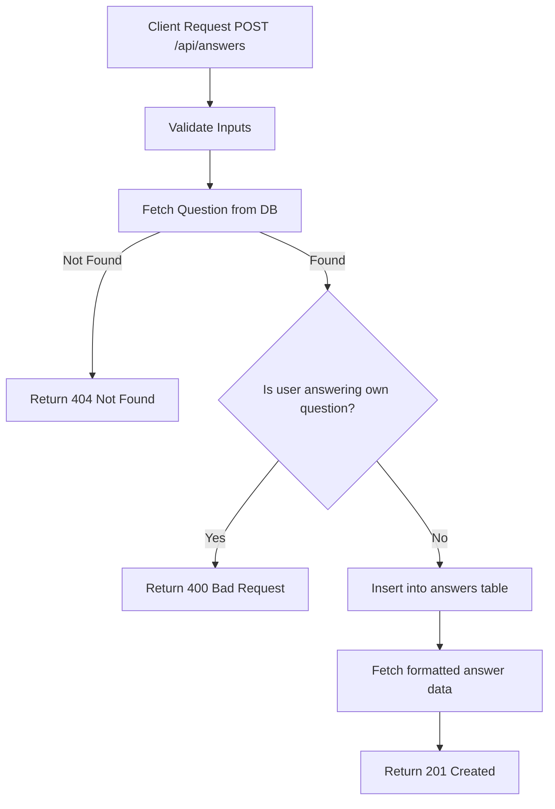

# Task: Create Answer

**Endpoint**: `POST /api/answers`

## 1. API Documentation

- **Method**: `POST`
- **URL**: `/api/answers`
- **Access**: Protected (Requires Bearer Token)
- **Content-Type**: `application/json`
- **Request Body**:
  ```json
  {
    "questionId": 1,
    "content": "string (min 20 chars, required)"
  }
  ```
- **Response (201 Created)**:
  ```json
  {
    "success": true,
    "message": "Answer posted successfully",
    "data": {
      "id": 1,
      "questionId": 1,
      "content": "You can connect React to Express by...",
      "createdAt": "2026-04-20T...",
      "updatedAt": "2026-04-20T...",
      "author": {
        "id": 2,
        "firstName": "Chala",
        "lastName": "T"
      }
    }
  }
  ```

## 2. Instructions

1. Implement `createAnswerValidation` in `answer.validation.js` to ensure `questionId` is an integer and `content` is at least 20 characters.
2. Implement `createAnswerController` in `answer.controller.js` to receive the payload and the authenticated `req.user.id`.
3. In `answer.service.js`, write `createAnswerService`:
   - Fetch the question to verify it exists and check its owner.
   - Throw a `BadRequestError` if the user is answering their own question.
   - Insert the answer into the `answers` table using `safeExecute`.
   - Retrieve and return the newly created answer object.

## 3. Logic & Git Instructions

### Logic Steps

1. **Validate Input**: Check `questionId` presence and `content` length.
2. **Fetch Question Owner**: Query the `questions` table for the given `questionId`. Return 404 if not found.
3. **Check Ownership**: If the question's `user_id` matches the authenticated `userId`, throw a 400 error.
4. **Insert Answer**: Execute the `INSERT` SQL statement.
5. **Return Data**: Fetch the newly inserted answer details (including author info) and return it.

### Git Workflow

```bash
git checkout main
git pull origin main
git checkout -b feature/T-12-answers-crud
# Make your changes
git add .
git commit -m "[T-12] Implement POST /api/answers"
git push origin feature/T-12-answers-crud
```

### PR Checklist (include in every PR description)
```markdown
- [ ] Code compiles with no errors (`npm run dev` starts cleanly)
- [ ] Postman tests pass for all endpoints in this task (backend tasks)
- [ ] No console errors in the browser (frontend tasks)
- [ ] All acceptance criteria from the task are met
- [ ] Files match the exact paths listed in the task
```


## 4. Logic Diagram


