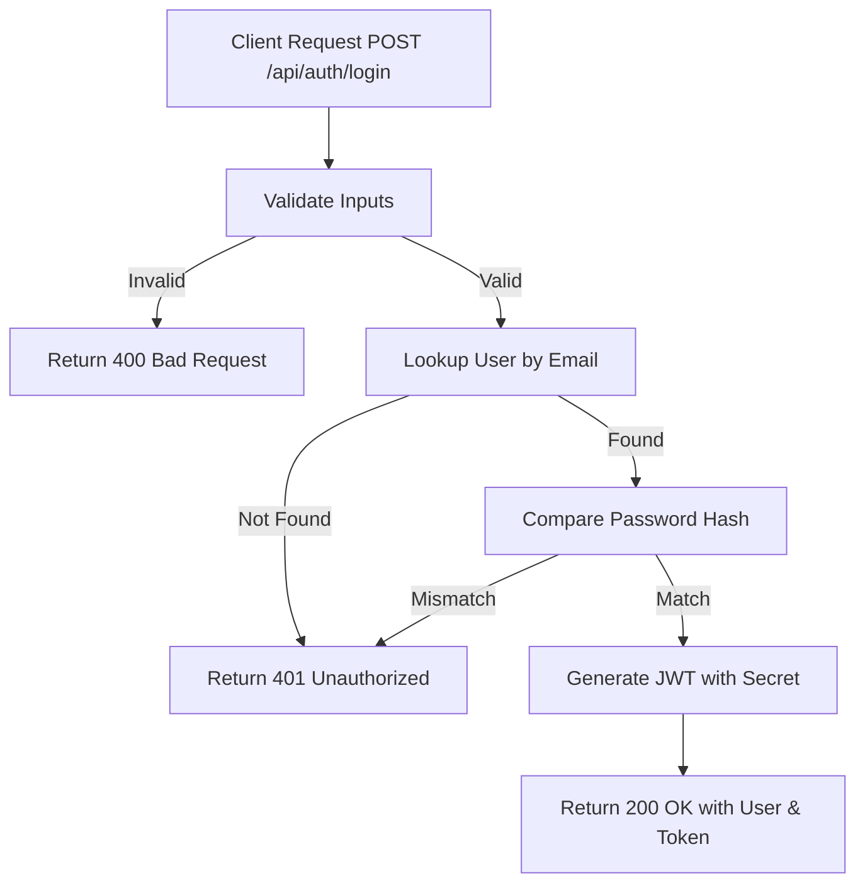

# Task: Login User

**Endpoint**: `POST /api/auth/login`

## 1. API Documentation

- **Method**: `POST`
- **URL**: `/api/auth/login`
- **Access**: Public
- **Content-Type**: `application/json`
- **Request Body**:
  ```json
  {
    "email": "string (valid email, required)",
    "password": "string (required)"
  }
  ```
- **Response (200 OK)**:
  ```json
  {
    "success": true,
    "message": "Login successful",
    "user": {
      "id": 1,
      "firstName": "Abebe",
      "lastName": "Kebede",
      "email": "abebe@test.com"
    },
    "token": "eyJhbGciOiJIUzI1NiIsInR5cCI..."
  }
  ```

## 2. Instructions

1. Add `loginValidation` in `auth.validation.js` to ensure `email` and `password` are provided.
2. Implement `loginController` in `auth.controller.js` to extract credentials from `req.body`.
3. In `auth.service.js`, write `loginService`:
   - Lookup the user by `email` in the `users` table.
   - Compare the provided password against the stored `password_hash` using `bcrypt.compare`.
   - If successful, generate a JWT containing the user's `id`, `firstName`, and `lastName`.
   - Return the user object and the generated token.

## 3. Logic & Git Instructions

### Logic Steps

1. **Validate Input**: Check that both `email` and `password` fields are provided in the request body.
2. **Lookup User**: Query the `users` table by the provided email. If the user doesn't exist, throw an `UnauthenticatedError`.
3. **Verify Password**: Use `bcrypt.compare` to verify the plain text password against the hashed password. Throw `UnauthenticatedError` if they don't match.
4. **Generate JWT**: Create a JSON Web Token payload containing the user's `id`, `firstName`, and `lastName`. Sign it using `process.env.JWT_SECRET`.
5. **Return Payload**: Send the user details and the signed JWT back to the client.

### Git Workflow

```bash
git checkout main
git pull origin main
git checkout -b feature/T-05-auth-login
# Make your changes
git add .
git commit -m "[T-05] Implement user login and JWT generation"
git push origin feature/T-05-auth-login
```

### PR Checklist (include in every PR description)
```markdown
- [ ] Code compiles with no errors (`npm run dev` starts cleanly)
- [ ] Postman tests pass for all endpoints in this task (backend tasks)
- [ ] No console errors in the browser (frontend tasks)
- [ ] All acceptance criteria from the task are met
- [ ] Files match the exact paths listed in the task
```

## 4. Logic Diagram

