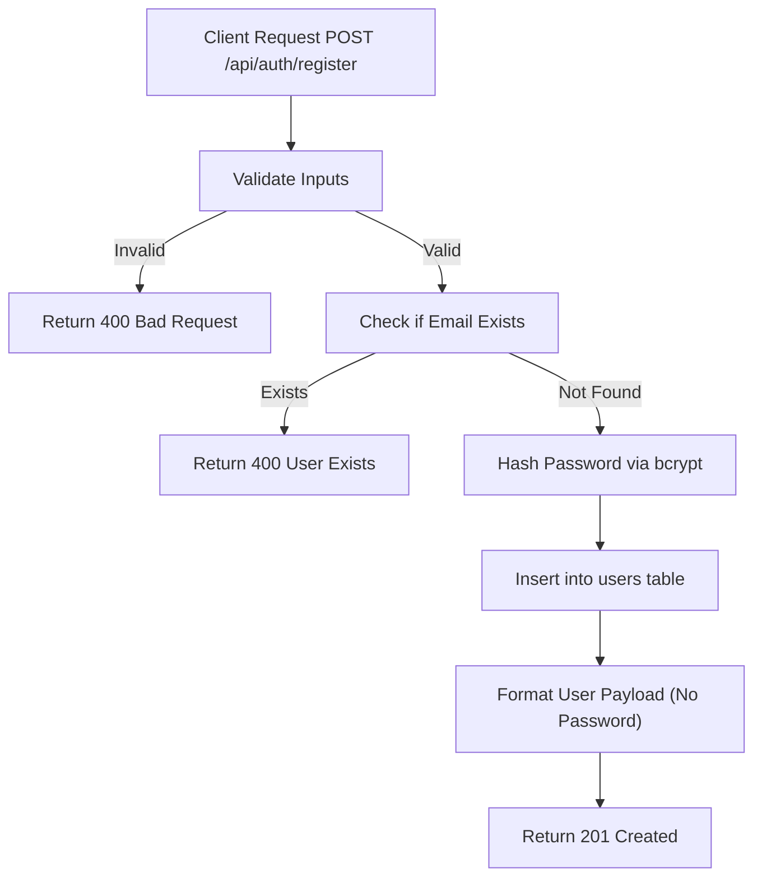

# Task: Register User

**Endpoint**: `POST /api/auth/register`

## 1. API Documentation

- **Method**: `POST`
- **URL**: `/api/auth/register`
- **Access**: Public
- **Content-Type**: `application/json`
- **Request Body**:
  ```json
  {
    "firstName": "string (min 3 chars, required)",
    "lastName": "string (min 3 chars, required)",
    "email": "string (valid email, required)",
    "password": "string (min 6 chars, required)"
  }
  ```
- **Response (201 Created)**:
  ```json
  {
    "success": true,
    "message": "User registered successfully",
    "user": {
      "id": 1,
      "firstName": "Abebe",
      "lastName": "Kebede",
      "email": "abebe@test.com"
    }
  }
  ```

## 2. Instructions

1. Add `registerValidation` in `auth.validation.js` to ensure the required fields (`firstName`, `lastName`, `email`, `password`) are provided and meet length/format constraints using `express-validator`.
2. Implement `registerController` in `auth.controller.js` to extract data from `req.body`.
3. In `auth.service.js`, write `registerService`:
   - Check if a user already exists with the given email.
   - Hash the password using `bcryptjs`.
   - Insert the new user into the `users` table using `safeExecute`.
   - Return the user profile (without the password).

## 3. Logic & Git Instructions

### Logic Steps

1. **Validate Input**: Check fields `firstName` (min 3 chars), `lastName` (min 3 chars), `email` (valid email format), and `password` (min 6 chars).
2. **Normalize Data**: Trim inputs and convert the `email` to lowercase.
3. **Check Duplicate**: Query the database to ensure the email is not already taken. If taken, throw a `BadRequestError`.
4. **Hash Password**: Generate a salt and hash the password using `bcrypt`.
5. **Database Insert**: Insert the user into the `users` table and retrieve the generated `user_id`.
6. **Return Payload**: Send back the user object without the hashed password.

### Git Workflow

```bash
git checkout main
git pull origin main
git checkout -b feature/T-04-auth-register
# Make your changes
git add .
git commit -m "[T-04] Implement user registration"
git push origin feature/T-04-auth-register
```

### PR Checklist (include in every PR description)

```markdown
- [ ] Code compiles with no errors (`npm run dev` starts cleanly)
- [ ] Postman tests pass for all endpoints in this task (backend tasks)
- [ ] No console errors in the browser (frontend tasks)
- [ ] All acceptance criteria from the task are met
- [ ] Files match the exact paths listed in the task
```

## 4. Logic Diagram


