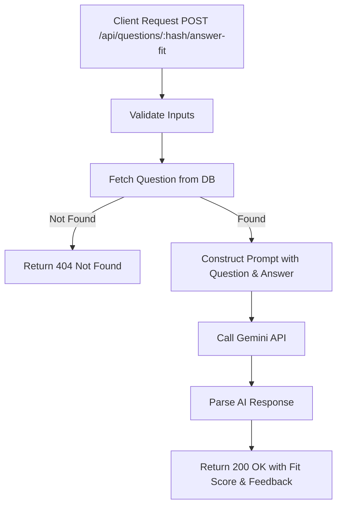

# Task: AI Answer Fit Evaluation

**Endpoint**: `POST /api/questions/:questionHash/answer-fit`

## 1. API Documentation

- **Method**: `POST`
- **URL**: `/api/questions/:questionHash/answer-fit`
- **Access**: Protected (Requires Bearer Token)
- **Path Params**: `questionHash` (16-char hex)
- **Content-Type**: `application/json`
- **Request Body**:
  ```json
  {
    "answerText": "string (min 20 chars, required)"
  }
  ```
- **Response (200 OK)**:
  ```json
  {
    "success": true,
    "message": "Answer fit assessed",
    "data": {
      "level": "strong",
      "note": "Your answer is highly relevant and addresses the core issue..."
    }
  }
  ```

## 2. Instructions

1. Validate `questionHash` and `answerContent` in `question.validation.js`.
2. Implement `assessAnswerAgainstQuestionController` in `question.controller.js`.
3. In `geminiTextCoach.service.js`, write `assessAnswerAgainstQuestionService`:
   - Fetch the question title and content using the `questionHash`.
   - Construct a prompt providing both the original question and the draft answer to Gemini.
   - Parse the response to extract `level` and `note`.

## 3. Logic & Git Instructions

### Logic Steps

1. **Lookup Question**: Retrieve the question details from the database using the hash. Return 404 if not found.
2. **Build Prompt**: Formulate a prompt asking the AI to evaluate how well the answer addresses the question, outputting a level (strong/partial/weak) and a note.
3. **Invoke Gemini**: Request content generation.
4. **Parse Response**: Extract the structured JSON containing level and note from the AI's response text.

### Git Workflow

```bash
git checkout main
git pull origin main
git checkout -b feature/T-18-answer-fit
# Make your changes
git add .
git commit -m "[T-18] Implement AI answer fit evaluation"
git push origin feature/T-18-answer-fit
```

### PR Checklist (include in every PR description)
```markdown
- [ ] Code compiles with no errors (`npm run dev` starts cleanly)
- [ ] Postman tests pass for all endpoints in this task (backend tasks)
- [ ] No console errors in the browser (frontend tasks)
- [ ] All acceptance criteria from the task are met
- [ ] Files match the exact paths listed in the task
```


## 4. Logic Diagram


