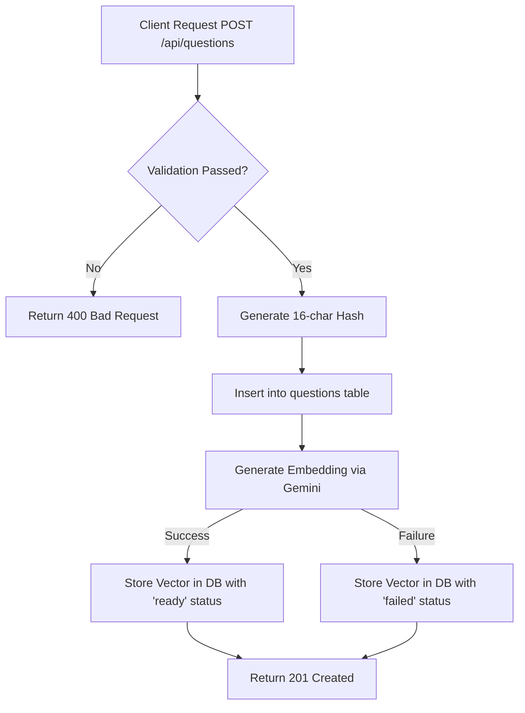

# Task: Create Question & Auto-Embed

**Endpoint**: `POST /api/questions`

## 1. API Documentation
- **Method**: `POST`
- **URL**: `/api/questions`
- **Access**: Protected (Requires Bearer Token)
- **Content-Type**: `application/json`
- **Request Body**:
  ```json
  {
    "title": "string (5-255 chars, required)",
    "content": "string (min 10 chars, required)"
  }
  ```
- **Response (201 Created)**:
  ```json
  {
    "success": true,
    "message": "Question posted successfully.",
    "data": {
      "id": 1,
      "questionHash": "a1b2c3d4e5f67890",
      "title": "How do I connect React to Express?",
      "content": "I have a React frontend...",
      "userId": 1
    }
  }
  ```

## 2. Instructions
1. Create a validation schema `createQuestionValidation` in `question.validation.js` using `express-validator` to ensure `title` and `content` are provided and meet length requirements.
2. Implement `createQuestionController` in `question.controller.js` to extract data from `req.body` and user ID from `req.user`.
3. In `question.service.js`, write `createQuestionWithVectorService` to:
   - Generate a unique 16-character `questionHash`.
   - Insert the question into the `questions` table using `safeExecute`.
   - Call Gemini API to generate vector embeddings for the question title.
   - Store the vector in the `question_vectors` table.

## 3. Logic & Git Instructions
### Logic Steps
1. **Validate Input**: Check title (5-255 chars) and content (min 10 chars).
2. **Generate Hash**: Create a random 16-hex character string.
3. **Database Insert**: Insert into `questions` table and retrieve the inserted ID.
4. **Vector Embedding**: Request a vector embedding from Gemini AI (`taskType: 'RETRIEVAL_DOCUMENT'`).
5. **Store Vector**: Save the vector to `question_vectors`. If embedding fails, save it with `status: 'failed'`.

### Git Workflow
```bash
git checkout main
git pull origin main
git checkout -b feature/T-09-create-question
# Make your changes
git add .
git commit -m "[T-09] Implement POST /api/questions and vector embedding"
git push origin feature/T-09-create-question
# Open a Pull Request on GitHub
```

## 4. Logic Diagram

