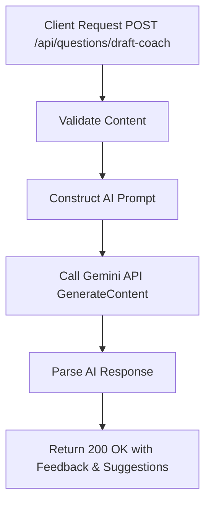

# Task: AI Question Draft Coach

**Endpoint**: `POST /api/questions/draft-coach`

## 1. API Documentation

- **Method**: `POST`
- **URL**: `/api/questions/draft-coach`
- **Access**: Protected (Requires Bearer Token)
- **Content-Type**: `application/json`
- **Request Body**:
  ```json
  {
    "title": "string (optional)",
    "content": "string (required)"
  }
  ```
- **Response (200 OK)**:
  ```json
  {
    "success": true,
    "message": "Draft suggestions generated",
    "data": {
      "tips": ["Add a code snippet", "Include error messages"]
    }
  }
  ```

## 2. Instructions

1. Add validation `generateQuestionDraftCoachValidation` in `question.validation.js`.
2. Implement `generateQuestionDraftCoachController` in `question.controller.js`.
3. In `geminiTextCoach.service.js`, write `generateQuestionDraftCoachService`:
   - Construct a prompt asking Gemini to evaluate the draft title and content.
   - Call `gemini.generateContent`.
   - Parse the response into structured feedback and suggestions.

## 3. Logic & Git Instructions

### Logic Steps

1. **Extract Input**: Get title and content from `req.body`.
2. **Build Prompt**: Create a system prompt instructing the AI to act as a programming forum coach, asking it to review clarity, formatting, and completeness.
3. **Invoke Gemini**: Send the prompt using the generative text model.
4. **Parse Result**: Format the AI's textual response into a JSON structure containing `feedback` and `suggestions`.

### Git Workflow

```bash
git checkout main
git pull origin main
git checkout -b feature/T-17-draft-coach
# Make your changes
git add .
git commit -m "[T-17] Implement AI draft coach for questions"
git push origin feature/T-17-draft-coach
```

### PR Checklist (include in every PR description)
```markdown
- [ ] Code compiles with no errors (`npm run dev` starts cleanly)
- [ ] Postman tests pass for all endpoints in this task (backend tasks)
- [ ] No console errors in the browser (frontend tasks)
- [ ] All acceptance criteria from the task are met
- [ ] Files match the exact paths listed in the task
```


## 4. Logic Diagram


