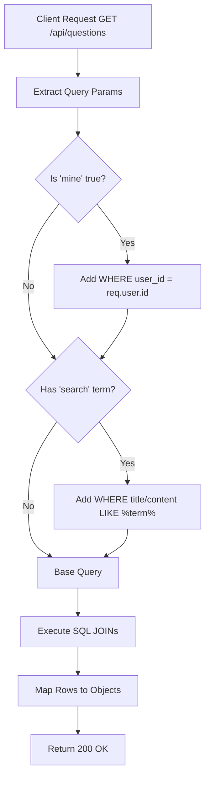

# Task: List Questions

**Endpoint**: `GET /api/questions`

## 1. API Documentation

- **Method**: `GET`
- **URL**: `/api/questions`
- **Access**: Protected (Requires Bearer Token)
- **Query Params**:
  - `search` (optional string): Filter by title or content (SQL LIKE).
  - `mine` (optional boolean): When true, return only questions created by the authenticated user.
- **Response (200 OK)**:
  ```json
  {
    "success": true,
    "message": "Questions fetched successfully.",
    "data": [
      {
        "id": 1,
        "questionHash": "a1b2c3d4e5f67890",
        "title": "How do I connect React to Express?",
        "content": "...",
        "answerCount": 3,
        "createdAt": "2026-04-20T...",
        "updatedAt": "2026-04-20T...",
        "author": { "id": 1, "firstName": "Abebe", "lastName": "Kebede" }
      }
    ],
    "meta": {
      "limit": 100,
      "total": 1,
      "sortBy": "newest",
      "sortOrder": "desc"
    }
  }
  ```

## 2. Instructions

1. Implement `getQuestionsValidation` in `question.validation.js` to optionally validate query parameters.
2. Create `getQuestionsController` in `question.controller.js` to extract query params and user ID.
3. In `question.service.js`, write `getQuestionsService` to:
   - Build a dynamic SQL query based on filters.
   - Join `users` table for author details.
   - Left join `answers` table to count answers.
   - Execute query with `safeExecute` and return results.

## 3. Logic & Git Instructions

### Logic Steps

1. **Extract Filters**: Get `search` and `mine` from the request query.
2. **Build Query**:
   - Start with base `SELECT` joining `users` and `answers`.
   - If `search` exists, append `WHERE title LIKE ? OR content LIKE ?`.
   - If `mine` exists, append `WHERE user_id = ?`.
3. **Execute & Group**: Group by question ID to accurately count answers and execute the query.
4. **Format Output**: Map the flat DB rows to structured JSON objects.

### Git Workflow

```bash
git checkout main
git pull origin main
git checkout -b feature/T-10-list-questions
# Make your changes
git add .
git commit -m "[T-10] Implement GET /api/questions with filtering"
git push origin feature/T-10-list-questions
```

### PR Checklist (include in every PR description)
```markdown
- [ ] Code compiles with no errors (`npm run dev` starts cleanly)
- [ ] Postman tests pass for all endpoints in this task (backend tasks)
- [ ] No console errors in the browser (frontend tasks)
- [ ] All acceptance criteria from the task are met
- [ ] Files match the exact paths listed in the task
```


## 4. Logic Diagram


