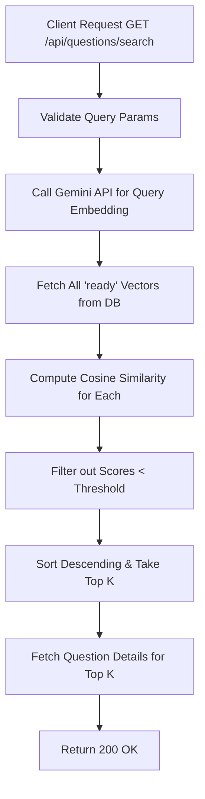

# Task: Semantic Search Questions

**Endpoint**: `GET /api/questions/search`

## 1. API Documentation

- **Method**: `GET`
- **URL**: `/api/questions/search`
- **Access**: Protected (Requires Bearer Token)
- **Query Params**:
  - `query` (string, required): Minimum 5 chars.
  - `k` (integer, optional): Maximum number of results to return (min 1, max 20, default 5).
  - `threshold` (float, optional): Minimum cosine similarity score (0–1). Defaults to RECOMMEND_THRESHOLD (0.75).
- **Response (200 OK)**:
  ```json
  {
    "success": true,
    "message": "Semantic search completed successfully",
    "data": [
      {
        "id": 3,
        "questionHash": "a1b2...",
        "title": "...",
        "content": "...",
        "answerCount": 2,
        "createdAt": "2026-04-20T...",
        "updatedAt": "2026-04-20T...",
        "author": { "id": 1, "firstName": "A", "lastName": "K" },
        "score": 0.891234
      }
    ],
    "meta": {
      "total": 1,
      "k": 5,
      "threshold": 0.75,
      "query": "how to connect react",
      "questionHash": null
    }
  }
  ```

## 2. Instructions

1. Validate `query`, `k`, and `threshold` in `question.validation.js`.
2. Implement `searchQuestionsSemanticController` to pass parameters to the service.
3. In `question.service.js`, implement semantic search logic:
   - Call Gemini `embedContent` with `taskType: 'RETRIEVAL_QUERY'` to embed the search string.
   - Fetch all active question embeddings from the DB.
   - Calculate cosine similarity between the query embedding and DB vectors.
   - Sort and filter results based on score and threshold.

## 3. Logic & Git Instructions

### Logic Steps

1. **Validate Input**: Ensure `query` is at least 5 characters.
2. **Embed Query**: Convert the text query to a vector embedding via Gemini API.
3. **Fetch Database Vectors**: Retrieve all `question_vectors` where `status='ready'`.
4. **Calculate Similarity**: Iterate through vectors, computing cosine similarity using dot product formula.
5. **Sort & Filter**: Remove scores below `threshold`, sort descending, take top `k`.
6. **Fetch Question Details**: Retrieve actual question and author details for the matching IDs.

### Git Workflow

```bash
git checkout main
git pull origin main
git checkout -b feature/T-11-semantic-search
# Make your changes
git add .
git commit -m "[T-11] Implement semantic search for questions"
git push origin feature/T-11-semantic-search
```

### PR Checklist (include in every PR description)
```markdown
- [ ] Code compiles with no errors (`npm run dev` starts cleanly)
- [ ] Postman tests pass for all endpoints in this task (backend tasks)
- [ ] No console errors in the browser (frontend tasks)
- [ ] All acceptance criteria from the task are met
- [ ] Files match the exact paths listed in the task
```


## 4. Logic Diagram


