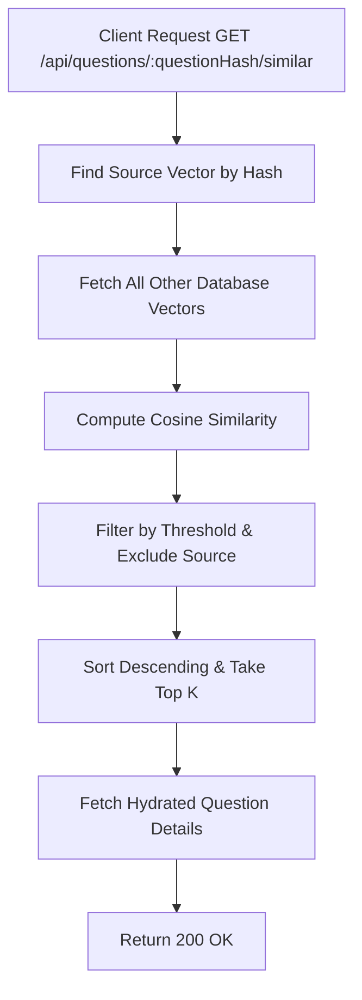

# Task: Find Similar Questions

**Endpoint**: `GET /api/questions/:questionHash/similar`

## 1. API Documentation

- **Method**: `GET`
- **URL**: `/api/questions/:questionHash/similar`
- **Access**: Protected (Requires Bearer Token)
- **Path Params**: `questionHash` (16-char hex)
- **Query Params**:
  - `k` (integer, optional): Maximum number of results to return (min 1, max 20, default 5).
  - `threshold` (float, optional): Minimum cosine similarity score (0–1). Defaults to RECOMMEND_THRESHOLD (0.75).
- **Response (200 OK)**:
  ```json
  {
    "success": true,
    "message": "Similar questions fetched successfully",
    "data": [
      {
        "id": 5,
        "questionHash": "b2c3...",
        "title": "...",
        "content": "...",
        "answerCount": 1,
        "createdAt": "2026-04-20T...",
        "updatedAt": "2026-04-20T...",
        "author": { "id": 2, "firstName": "C", "lastName": "T" },
        "score": 0.87
      }
    ],
    "meta": {
      "total": 1,
      "k": 5,
      "threshold": 0.75,
      "query": null,
      "questionHash": "a1b2c3d4e5f67890"
    }
  }
  ```

## 2. Instructions

1. Validate `questionHash` format in `question.validation.js`.
2. Implement `getSimilarQuestionsController` to handle the request.
3. In `question.service.js`, write `getSimilarQuestionsService`:
   - Retrieve the vector embedding of the requested `questionHash`.
   - Compute similarity against all other vectors.
   - Exclude the source question from the results.

## 3. Logic & Git Instructions

### Logic Steps

1. **Find Source Question**: Lookup the `question_id` and its vector by `questionHash`.
2. **Fetch Vectors**: Retrieve all other `question_vectors` (excluding the source).
3. **Calculate Similarity**: Perform cosine similarity calculation.
4. **Sort and Filter**: Filter by threshold, sort by score descending, limit to `k`.
5. **Hydrate Data**: Fetch the question title and author details for the similar IDs.

### Git Workflow

```bash
git checkout main
git pull origin main
git checkout -b feature/T-11-similar-questions
# Make your changes
git add .
git commit -m "[T-11] Implement similar questions endpoint"
git push origin feature/T-11-similar-questions
```

### PR Checklist (include in every PR description)
```markdown
- [ ] Code compiles with no errors (`npm run dev` starts cleanly)
- [ ] Postman tests pass for all endpoints in this task (backend tasks)
- [ ] No console errors in the browser (frontend tasks)
- [ ] All acceptance criteria from the task are met
- [ ] Files match the exact paths listed in the task
```


## 4. Logic Diagram


