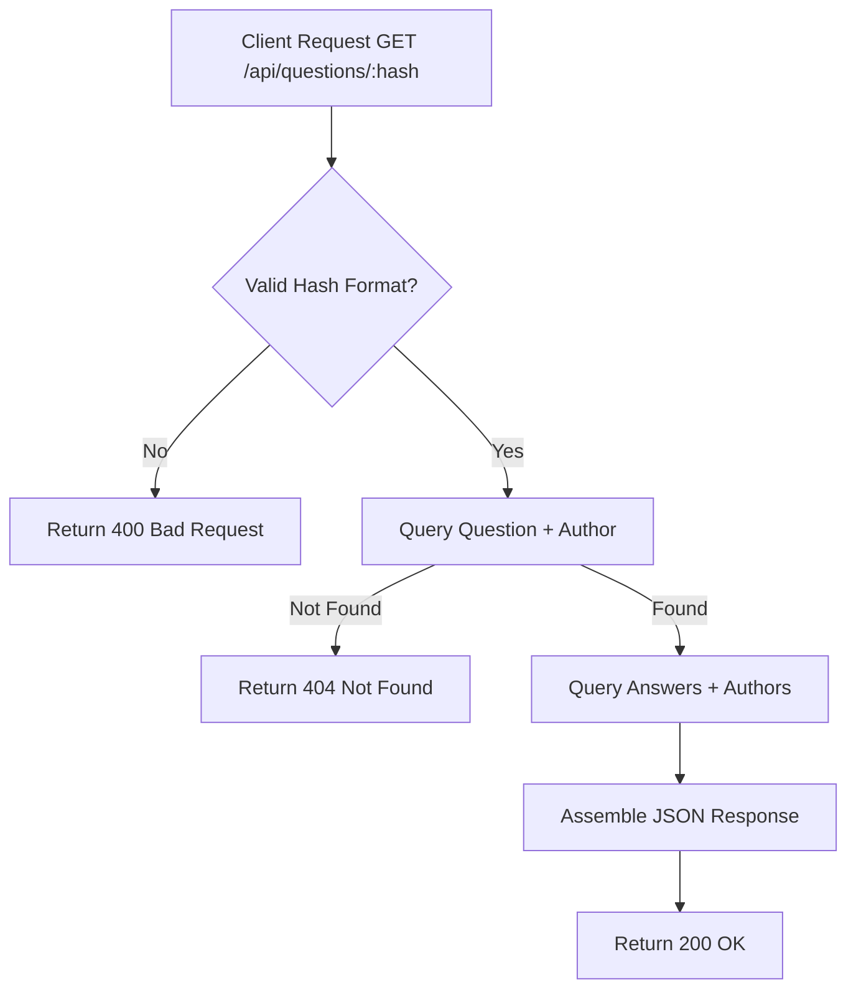

# Task: Get Single Question Details

**Endpoint**: `GET /api/questions/:questionHash`

## 1. API Documentation

- **Method**: `GET`
- **URL**: `/api/questions/:questionHash`
- **Access**: Protected (Requires Bearer Token)
- **Path Params**: `questionHash` (16-char lowercase hex string)
- **Response (200 OK)**:
  ```json
  {
    "success": true,
    "message": "Question fetched successfully",
    "question": {
      "id": 1,
      "questionHash": "a1b2c3d4e5f67890",
      "title": "...",
      "content": "...",
      "answerCount": 3,
      "createdAt": "2026-04-20T...",
      "updatedAt": "2026-04-20T...",
      "author": { "id": 1, "firstName": "Abebe", "lastName": "Kebede" }
    },
    "answers": [
      {
        "id": 1,
        "content": "...",
        "createdAt": "2026-04-20T...",
        "updatedAt": "2026-04-20T...",
        "author": { "id": 2, "firstName": "Chala", "lastName": "T" }
      }
    ],
    "answersMeta": { "limit": 100, "total": 1 }
  }
  ```

## 2. Instructions

1. Validate `questionHash` format using regex `/^[a-f0-9]{16}$/` in `question.validation.js`.
2. Implement `getSingleQuestionController` in `question.controller.js`.
3. In `question.service.js`, write `getSingleQuestionService`:
   - Fetch the question details and author from the `questions` and `users` tables.
   - Return 404 if the question does not exist.
   - Fetch all related answers and their authors.

## 3. Logic & Git Instructions

### Logic Steps

1. **Validate Hash**: Ensure hash matches the exact 16-character hex pattern.
2. **Fetch Question**: Query the `questions` table joining `users`. Throw `NotFoundError` if missing.
3. **Fetch Answers**: Query the `answers` table for this `question_id`, joining `users`.
4. **Assemble Payload**: Combine the question object and the answers array into the final response format.

### Git Workflow

```bash
git checkout main
git pull origin main
git checkout -b feature/T-10-single-question
# Make your changes
git add .
git commit -m "[T-10] Implement GET /api/questions/:questionHash"
git push origin feature/T-10-single-question
```

### PR Checklist (include in every PR description)
```markdown
- [ ] Code compiles with no errors (`npm run dev` starts cleanly)
- [ ] Postman tests pass for all endpoints in this task (backend tasks)
- [ ] No console errors in the browser (frontend tasks)
- [ ] All acceptance criteria from the task are met
- [ ] Files match the exact paths listed in the task
```


## 4. Logic Diagram


