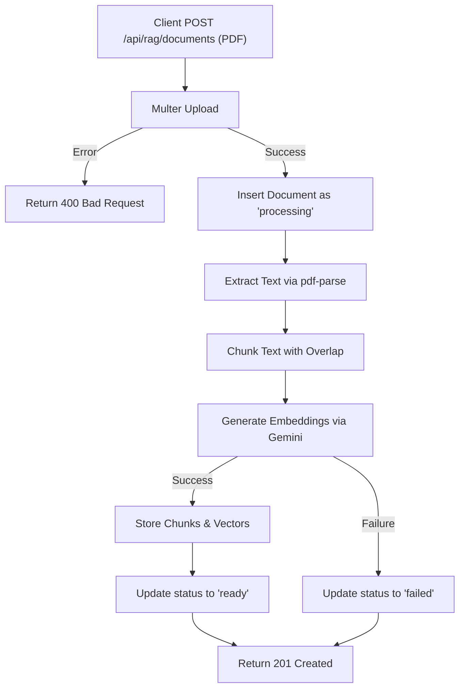

# Task: Upload & Process RAG Document

**Endpoint**: `POST /api/rag/documents`

## 1. API Documentation

- **Method**: `POST`
- **URL**: `/api/rag/documents`
- **Access**: Protected (Requires Bearer Token)
- **Content-Type**: `multipart/form-data`
- **Form Data**:
  - `file`: PDF file to upload (Max 10MB)
- **Response (201 Created)**:
  ```json
  {
    "success": true,
    "message": "Document uploaded and processed.",
    "data": {
      "document_id": 1,
      "title": "React_Docs.pdf",
      "mime_type": "application/pdf",
      "byte_size": 1048576,
      "status": "ready",
      "error_message": null,
      "created_at": "2026-04-20T...",
      "updated_at": "2026-04-20T...",
      "user_id": 1,
      "storage_path": "1/1234-abc.pdf"
    }
  }
  ```

## 2. Instructions

1. Configure `multer` in `rag.upload.config.js` to accept only PDF files and set a size limit.
2. Implement `createDocumentMulterErrorHandler` to gracefully handle upload errors (like file too large).
3. Implement `createDocumentController` in `rag.controller.js` to pass `req.file` to the service.
4. In `rag.service.js`, write `createDocumentFromUploadService`:
   - Save the file path and insert a new document record with status `processing`.
   - Parse the PDF using `pdf-parse`.
   - Chunk the text into overlapping segments.
   - Generate embeddings for each chunk via Gemini API.
   - Store chunks and vectors in the DB, then update document status to `ready`.

## 3. Logic & Git Instructions

### Logic Steps

1. **File Upload**: Multer processes the `multipart/form-data` and saves the PDF.
2. **Initial DB Record**: Insert into `documents` table with `status='processing'`.
3. **Parse PDF**: Extract raw text from the saved PDF buffer.
4. **Chunking**: Split text into chunks (e.g., 1000 chars) with overlap (e.g., 150 chars).
5. **Embedding**: Call Gemini API for each chunk to get vector embeddings.
6. **Store Vectors**: Save chunks to `document_chunks` and embeddings to `document_chunk_vectors`.
7. **Finalize**: Update document status to `ready`. If any step fails, update to `failed` and store the error message.

### Git Workflow

```bash
git checkout main
git pull origin main
git checkout -b feature/T-22-rag-upload
# Make your changes
git add .
git commit -m "[T-22] Implement RAG PDF upload and chunking"
git push origin feature/T-22-rag-upload
```

### PR Checklist (include in every PR description)
```markdown
- [ ] Code compiles with no errors (`npm run dev` starts cleanly)
- [ ] Postman tests pass for all endpoints in this task (backend tasks)
- [ ] No console errors in the browser (frontend tasks)
- [ ] All acceptance criteria from the task are met
- [ ] Files match the exact paths listed in the task
```


## 4. Logic Diagram


