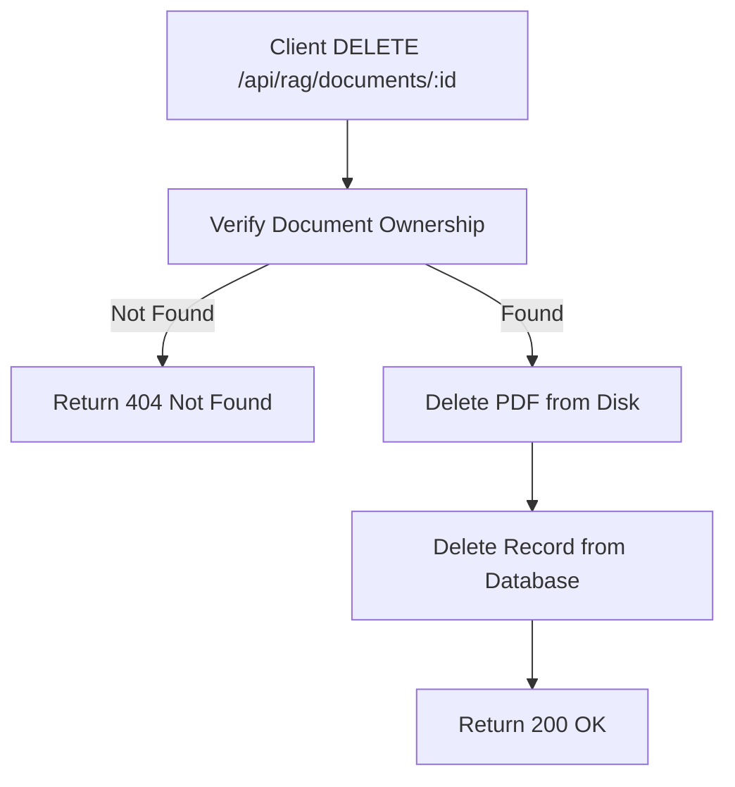

# Task: Delete RAG Document

**Endpoint**: `DELETE /api/rag/documents/:documentId`

## 1. API Documentation
- **Method**: `DELETE`
- **URL**: `/api/rag/documents/:documentId`
- **Access**: Protected (Requires Bearer Token)
- **Path Params**: `documentId` (integer)
- **Response (200 OK)**:
  ```json
  {
    "success": true,
    "message": "Document deleted successfully.",
    "data": { "id": 1 }
  }
  ```

## 2. Instructions
1. Validate `documentId` in `rag.validation.js`.
2. Implement `deleteDocumentController` in `rag.controller.js`.
3. In `rag.service.js`, write `deleteDocumentService`:
   - Verify document ownership.
   - Delete the PDF file from the disk using `fs.unlink`.
   - Delete the record from the database (foreign key constraints should CASCADE delete chunks and vectors).

## 3. Logic & Git Instructions
### Logic Steps
1. **Verify Ownership**: Fetch the document to ensure it belongs to the user.
2. **File System Deletion**: Resolve the absolute path of the PDF and remove it via the `fs/promises` module. Handle errors if the file is already missing.
3. **Database Deletion**: Execute the `DELETE` query on the `documents` table.
4. **Return Data**: Send a success response.

### Git Workflow
```bash
git checkout main
git pull origin main
git checkout -b feature/T-24-rag-documents
# Make your changes
git add .
git commit -m "[T-24] Implement DELETE /api/rag/documents/:documentId"
git push origin feature/T-24-rag-documents
```

## 4. Logic Diagram

