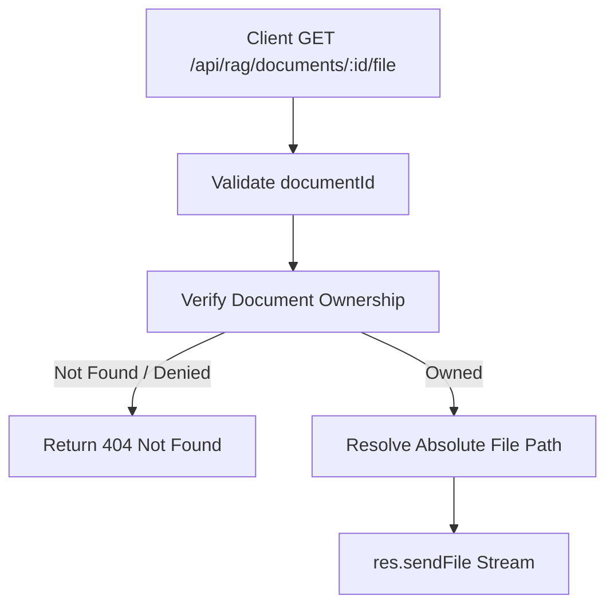

# Task: Stream RAG Document PDF

**Endpoint**: `GET /api/rag/documents/:documentId/file`

## 1. API Documentation
- **Method**: `GET`
- **URL**: `/api/rag/documents/:documentId/file`
- **Access**: Protected (Requires Bearer Token)
- **Path Params**: `documentId` (integer)
- **Response (200 OK)**:
  - Returns the raw PDF file stream (Content-Type: `application/pdf`).

## 2. Instructions
1. Add `documentIdParamValidation` in `rag.validation.js`.
2. Implement `getDocumentFileController` in `rag.controller.js`.
3. The controller should fetch the document metadata via `assertOwnedDocument` to verify ownership and retrieve the `storage_path`.
4. Construct the absolute file path on disk.
5. Use `res.sendFile()` to stream the PDF back to the client.

## 3. Logic & Git Instructions
### Logic Steps
1. **Validate Param**: Ensure `documentId` is provided and is a valid integer.
2. **Check Ownership**: Query the database to ensure the `documentId` belongs to the authenticated user. Return 404 if not found or not owned.
3. **Get Path**: Retrieve the `storage_path` relative path and resolve it to an absolute path on the server.
4. **Stream File**: Send the file back with the appropriate Content-Type header so the browser can render it inline.

### Git Workflow
```bash
git checkout main
git pull origin main
git checkout -b feature/T-24-rag-documents
# Make your changes
git add .
git commit -m "[T-24] Implement GET /api/rag/documents/:documentId/file"
git push origin feature/T-24-rag-documents
```

## 4. Logic Diagram

