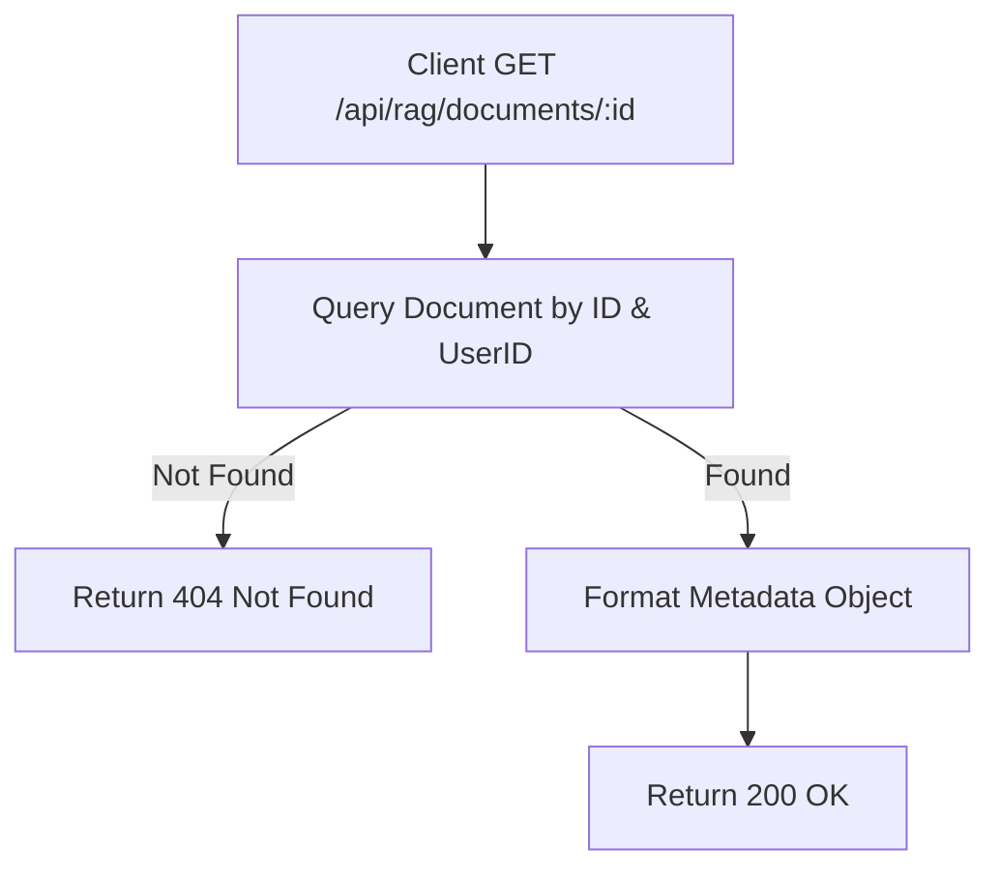

# Task: Get RAG Document Metadata

**Endpoint**: `GET /api/rag/documents/:documentId`

## 1. API Documentation

- **Method**: `GET`
- **URL**: `/api/rag/documents/:documentId`
- **Access**: Protected (Requires Bearer Token)
- **Path Params**: `documentId` (integer)
- **Response (200 OK)**:
  ```json
  {
    "success": true,
    "message": "Document fetched successfully.",
    "data": {
      "document_id": 1,
      "title": "React_Docs.pdf",
      "mime_type": "application/pdf",
      "byte_size": 1048576,
      "status": "ready",
      "error_message": null,
      "created_at": "2026-04-20T...",
      "updated_at": "2026-04-20T...",
      "user_id": 1,
      "storage_path": "1/1234-abc.pdf"
    }
  }
  ```

## 2. Instructions

1. Add `documentIdParamValidation` in `rag.validation.js`.
2. Implement `getDocumentMetaController` in `rag.controller.js`.
3. In `rag.service.js`, write `getDocumentMetaService`:
   - Query the `documents` table for the specified ID.
   - Verify that `user_id` matches the authenticated user.
   - Return 404 if not found.

## 3. Logic & Git Instructions

### Logic Steps

1. **Validate Param**: Ensure `documentId` is valid.
2. **Fetch Metadata**: Query the database using `safeExecute` for the document record matching both `documentId` and `userId`.
3. **Map Data**: Format the database row into a structured JSON object (hide internal paths or IDs if necessary).
4. **Return**: Send the JSON payload back to the client.

### Git Workflow

```bash
git checkout main
git pull origin main
git checkout -b feature/T-24-rag-documents
# Make your changes
git add .
git commit -m "[T-24] Implement GET /api/rag/documents/:documentId"
git push origin feature/T-24-rag-documents
```

### PR Checklist (include in every PR description)
```markdown
- [ ] Code compiles with no errors (`npm run dev` starts cleanly)
- [ ] Postman tests pass for all endpoints in this task (backend tasks)
- [ ] No console errors in the browser (frontend tasks)
- [ ] All acceptance criteria from the task are met
- [ ] Files match the exact paths listed in the task
```


## 4. Logic Diagram


