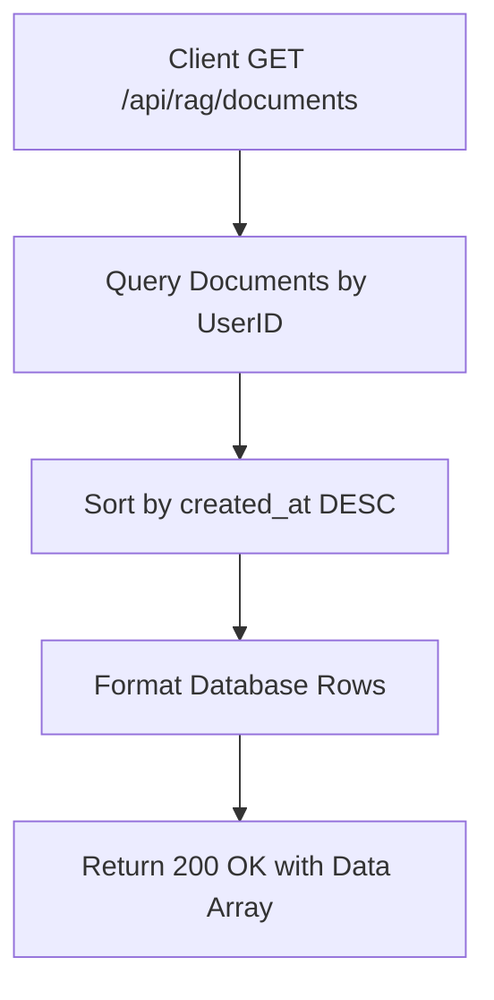

# Task: List My RAG Documents

**Endpoint**: `GET /api/rag/documents`

## 1. API Documentation
- **Method**: `GET`
- **URL**: `/api/rag/documents`
- **Access**: Protected (Requires Bearer Token)
- **Response (200 OK)**:
  ```json
  {
    "success": true,
    "message": "Documents fetched successfully.",
    "data": [
      {
        "document_id": 1,
        "title": "React_Docs.pdf",
        "mime_type": "application/pdf",
        "byte_size": 1048576,
        "status": "ready",
        "error_message": null,
        "created_at": "2026-04-20T...",
        "updated_at": "2026-04-20T..."
      }
    ]
  }
  ```

## 2. Instructions
1. The route does not require body or param validation, but requires authentication middleware.
2. Implement `listDocumentsController` in `rag.controller.js`.
3. In `rag.service.js`, write `listDocumentsForUserService`:
   - Query the `documents` table for all records where `user_id` matches the authenticated user.
   - Sort them descending by `created_at`.
   - Map and return the array.

## 3. Logic & Git Instructions
### Logic Steps
1. **Query Database**: Select all documents for `req.user.id`.
2. **Sort Data**: Ensure the latest uploads appear first (`ORDER BY created_at DESC`).
3. **Format Data**: Map raw database columns to camelCase JSON properties.
4. **Return Response**: Send the list to the client.

### Git Workflow
```bash
git checkout main
git pull origin main
git checkout -b feature/T-24-rag-documents
# Make your changes
git add .
git commit -m "[T-24] Implement GET /api/rag/documents list"
git push origin feature/T-24-rag-documents
```

## 4. Logic Diagram

