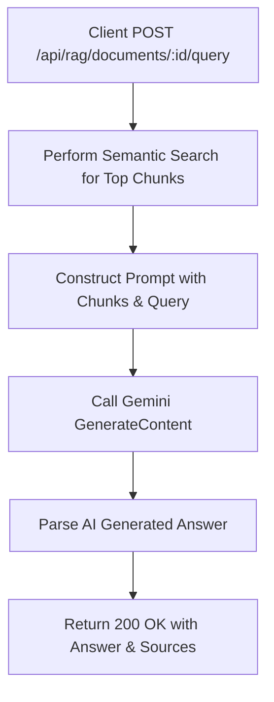

# Task: AI Query Grounded in RAG Document

**Endpoint**: `POST /api/rag/documents/:documentId/query`

## 1. API Documentation

- **Method**: `POST`
- **URL**: `/api/rag/documents/:documentId/query`
- **Access**: Protected (Requires Bearer Token)
- **Path Params**: `documentId` (integer)
- **Content-Type**: `application/json`
- **Request Body**:
  ```json
  {
    "query": "What is the main topic of this document?"
  }
  ```
- **Response (200 OK)**:
  ```json
  {
    "success": true,
    "message": "Answer and citations",
    "data": {
      "answer": "The document discusses...",
      "citations": [{ "ref": 1, "chunkIndex": 12 }],
      "chunksUsed": [42]
    }
  }
  ```

## 2. Instructions

1. Validate body (`query`) and path (`documentId`) in `rag.validation.js`.
2. Implement `queryDocumentController` in `rag.controller.js`.
3. In `rag.service.js`, write `queryDocumentService`:
   - Perform the semantic search to get the top `k` chunks (similar to `/search`).
   - Pass the user's query and the extracted chunk text to a Gemini generation prompt (`answerFromRagChunksService`).
   - Return the AI's answer along with the source chunks.

## 3. Logic & Git Instructions

### Logic Steps

1. **Semantic Search**: Re-use the logic from `searchInDocumentService` to find the most relevant chunks.
2. **Build Prompt**: Construct a prompt for Gemini containing the retrieved text chunks as context and the user's query.
3. **Generate Answer**: Ask Gemini to answer the query _only_ using the provided context chunks.
4. **Return Payload**: Send the AI's generated response back to the client, attaching the chunks used as "sources".

### Git Workflow

```bash
git checkout main
git pull origin main
git checkout -b feature/T-23-rag-query
# Make your changes
git add .
git commit -m "[T-23] Implement RAG document query generation"
git push origin feature/T-23-rag-query
```

### PR Checklist (include in every PR description)
```markdown
- [ ] Code compiles with no errors (`npm run dev` starts cleanly)
- [ ] Postman tests pass for all endpoints in this task (backend tasks)
- [ ] No console errors in the browser (frontend tasks)
- [ ] All acceptance criteria from the task are met
- [ ] Files match the exact paths listed in the task
```


## 4. Logic Diagram


