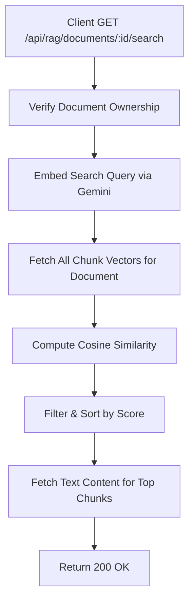

# Task: Semantic Search in RAG Document

**Endpoint**: `GET /api/rag/documents/:documentId/search`

## 1. API Documentation

- **Method**: `GET`
- **URL**: `/api/rag/documents/:documentId/search`
- **Access**: Protected (Requires Bearer Token)
- **Path Params**: `documentId` (integer)
- **Query Params**:
  - `query` (string, required): The search text.
  - `k` (integer, optional): Number of chunks to return (default 5).
- **Response (200 OK)**:
  ```json
  {
    "success": true,
    "message": "Ranked chunk excerpts",
    "data": {
      "query": "What is react?",
      "results": [
        {
          "chunkId": 42,
          "chunkIndex": 12,
          "score": 0.88,
          "excerpt": "Relevant text extracted from the PDF..."
        }
      ]
    }
  }
  ```

## 2. Instructions

1. Validate `documentId` and `query` in `rag.validation.js`.
2. Implement `searchInDocumentController` in `rag.controller.js`.
3. In `rag.service.js`, write `searchInDocumentService`:
   - Verify the user owns the document and its status is `ready`.
   - Embed the search query using Gemini API (`taskType: 'RETRIEVAL_QUERY'`).
   - Fetch all chunk vectors for this document.
   - Compute cosine similarity, filter by threshold, sort, and return the top `k` chunks.

## 3. Logic & Git Instructions

### Logic Steps

1. **Verify Ownership**: Ensure the document belongs to the user and is `ready`.
2. **Embed Query**: Convert the search text into a vector using Gemini.
3. **Fetch Chunks**: Retrieve all vector embeddings for this specific document.
4. **Calculate Similarity**: Compare query vector against chunk vectors using dot product.
5. **Sort & Filter**: Keep chunks above the threshold, sort by score descending, limit to `k`.
6. **Hydrate Data**: Fetch the actual text content for the top chunks.

### Git Workflow

```bash
git checkout main
git pull origin main
git checkout -b feature/T-23-rag-search
# Make your changes
git add .
git commit -m "[T-23] Implement RAG document semantic search"
git push origin feature/T-23-rag-search
```

### PR Checklist (include in every PR description)
```markdown
- [ ] Code compiles with no errors (`npm run dev` starts cleanly)
- [ ] Postman tests pass for all endpoints in this task (backend tasks)
- [ ] No console errors in the browser (frontend tasks)
- [ ] All acceptance criteria from the task are met
- [ ] Files match the exact paths listed in the task
```


## 4. Logic Diagram


