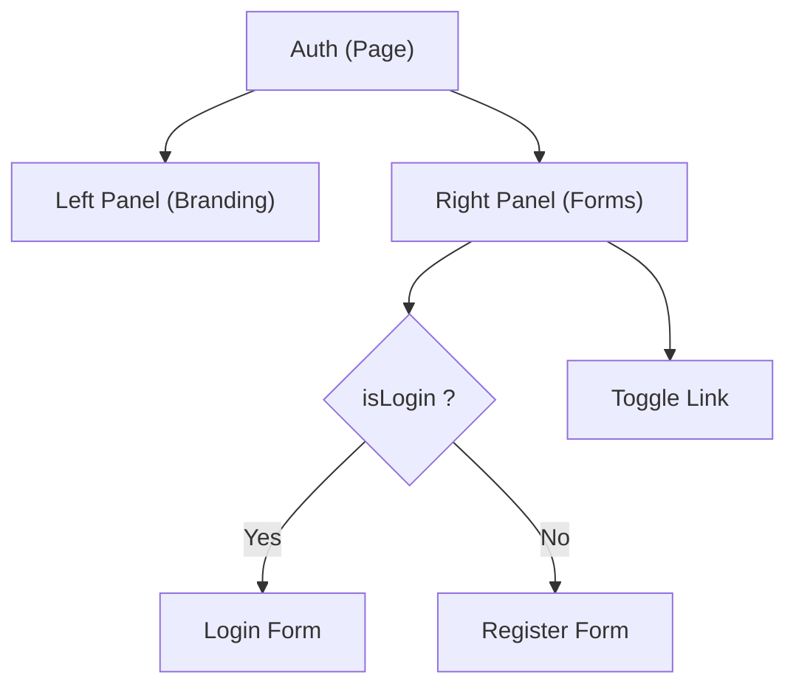

# Task: Auth Page (Login & Register)

## 1. Page Overview
The Auth page serves as the entry point for users to log in or create a new account. It features a split layout with branding on one side and a form on the other, using Framer Motion to toggle smoothly between Login and Registration states.

- **Path**: `/frontend/src/pages/Auth/Auth.jsx`
- **Route**: `/auth`

## 2. Component Hierarchy


## 3. API Integrations
Uses `auth.service.js` methods exposed via `AuthContext`:
- `login({ email, password })` -> `POST /api/auth/login`
- `register({ firstName, lastName, email, password })` -> `POST /api/auth/register`

## 4. Detailed Logic
1. **State Management**: 
   - `isLogin` (boolean) to toggle between forms.
   - `formData` to hold input fields.
   - `error` and `success` for displaying messages.
   - `isLoading` to disable buttons during submission.
2. **Form Submission**:
   - If `isLogin`: Call `login()`. On success, redirect to `/dashboard` or the page the user tried to access (`location.state?.from`).
   - If `!isLogin`: Call `register()`. On success, show a success message, then auto-toggle to the login form after a short delay (e.g., 1.5s).
3. **Validation**: Check for empty fields and basic password length before calling the API. Show API errors in a red banner.
4. **UI/UX**: Implement a password visibility toggle (eye icon). Use `AnimatePresence` from `framer-motion` for smooth form transitions.

## 5. Git Workflow & PR Checklist
```bash
git checkout main
git pull origin main
git checkout -b feature/FE-auth-page
# Make your changes
git add .
git commit -m "[FE] Implement Auth page UI and logic"
git push origin feature/FE-auth-page
```

### PR Checklist (include in every PR description)
```markdown
- [ ] Code compiles with no errors (`npm run dev` starts cleanly)
- [ ] Postman tests pass for all endpoints in this task (backend tasks)
- [ ] No console errors in the browser (frontend tasks)
- [ ] All acceptance criteria from the task are met
- [ ] Files match the exact paths listed in the task
```