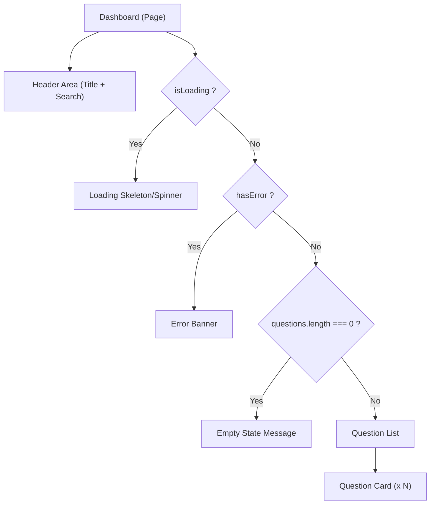

# Task: Dashboard Page

## 1. Page Overview
The Dashboard page is the main landing area after a user logs in. It displays a list of all questions asked by the community, allowing users to search, filter, and navigate to individual questions.

- **Path**: `/frontend/src/pages/Dashboard/Dashboard.jsx`
- **Route**: `/dashboard`

## 2. Component Hierarchy


## 3. API Integrations
Uses `question.service.js`:
- `getQuestions({ search })` -> `GET /api/questions`
- `searchQuestionsSemantic(query)` -> `GET /api/questions/search`

## 4. Detailed Logic
1. **State Management**:
   - `questions` array to store fetched data.
   - `searchQuery` string for the search bar.
   - `searchMode` (Keyword vs Semantic).
   - `isLoading` and `error` states.
2. **Data Fetching**:
   - On component mount, fetch all questions calling `getQuestions()`.
   - When the user types in the search bar and submits (or debounces):
     - If `searchMode` is Keyword: call `getQuestions({ search: searchQuery })`.
     - If `searchMode` is Semantic: call `searchQuestionsSemantic(searchQuery)`.
3. **UI/UX**:
   - Show a loading spinner during API calls.
   - Display an empty state ("No questions found") if the array is empty.
   - Format timestamps (e.g., "2 hours ago" or standard date).
   - Each Question Card should display title, author, answer count, and navigate to `/questions/:questionHash` on click.

## 5. Git Workflow & PR Checklist
```bash
git checkout main
git pull origin main
git checkout -b feature/FE-dashboard-page
# Make your changes
git add .
git commit -m "[FE] Implement Dashboard page UI and logic"
git push origin feature/FE-dashboard-page
```

### PR Checklist (include in every PR description)
```markdown
- [ ] Code compiles with no errors (`npm run dev` starts cleanly)
- [ ] Postman tests pass for all endpoints in this task (backend tasks)
- [ ] No console errors in the browser (frontend tasks)
- [ ] All acceptance criteria from the task are met
- [ ] Files match the exact paths listed in the task
```