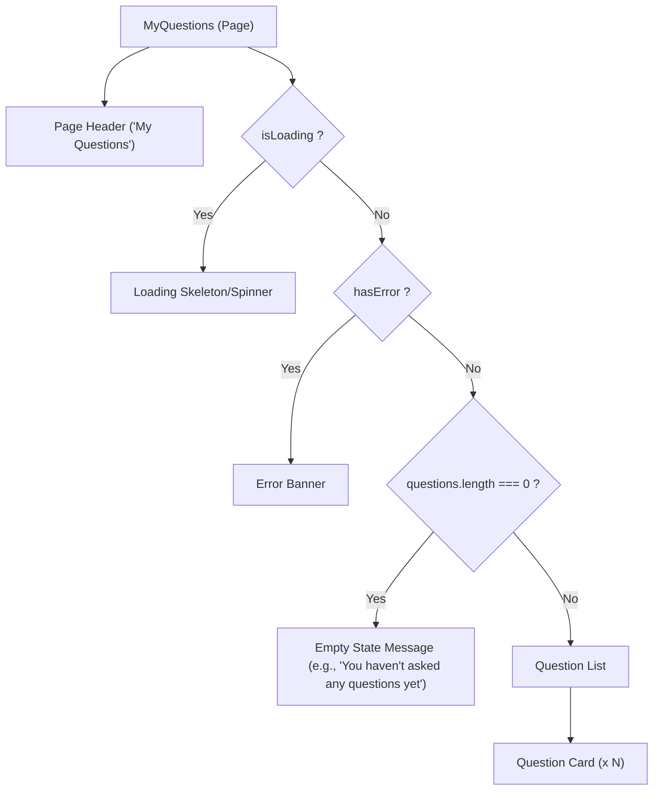

# Task: My Questions Page

## 1. Page Overview
The My Questions page displays only the questions authored by the currently authenticated user, providing a personalized view of their forum activity.

- **Path**: `/frontend/src/pages/MyQuestions/MyQuestions.jsx`
- **Route**: `/my-questions`

## 2. Component Hierarchy


## 3. API Integrations
Uses `question.service.js`:
- `getQuestions({ mine: true })` -> `GET /api/questions?mine=true`

## 4. Detailed Logic
1. **State Management**:
   - `myQuestions` array.
   - `isLoading` and `error` states.
2. **Data Fetching**:
   - On component mount, call `getQuestions({ mine: true })`.
   - Update `myQuestions` with the returned array.
3. **UI/UX**:
   - Reuse the `Question Card` component used in the Dashboard for consistency.
   - If empty, display an empty state encouraging the user to ask their first question (with a link to `/questions/ask`).
   - Handle loading and network errors gracefully.

## 5. Git Workflow & PR Checklist
```bash
git checkout main
git pull origin main
git checkout -b feature/FE-my-questions-page
# Make your changes
git add .
git commit -m "[FE] Implement My Questions page"
git push origin feature/FE-my-questions-page
```

### PR Checklist (include in every PR description)
```markdown
- [ ] Code compiles with no errors (`npm run dev` starts cleanly)
- [ ] Postman tests pass for all endpoints in this task (backend tasks)
- [ ] No console errors in the browser (frontend tasks)
- [ ] All acceptance criteria from the task are met
- [ ] Files match the exact paths listed in the task
```