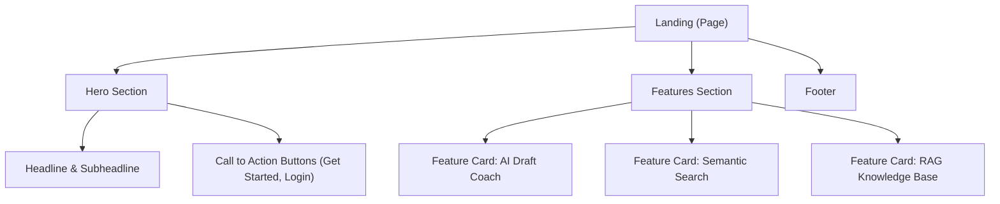

# Task: Public Landing Page

## 1. Page Overview
The Landing page is the unauthenticated home page of the application. It introduces the product, highlights its AI features, and directs users to sign up or log in.

- **Path**: `/frontend/src/pages/Landing/Landing.jsx`
- **Route**: `/`

## 2. Component Hierarchy


## 3. API Integrations
- **None**: This is a static public page.

## 4. Detailed Logic
1. **Routing**:
   - "Get Started" or "Join Now" buttons should navigate the user to `/auth` (defaulting to the register view if possible).
   - "Log In" should navigate to `/auth`.
2. **Auth Context Check**:
   - If a user is already authenticated (via `AuthContext`), visiting `/` should ideally redirect them to `/dashboard` directly, or the Hero section should say "Go to Dashboard" instead of "Get Started".
3. **UI/UX**:
   - Use Framer Motion for scroll animations (fade-in or slide-up effects) on the feature cards.
   - Use `lucide-react` icons to visually represent the features.

## 5. Git Workflow & PR Checklist
```bash
git checkout main
git pull origin main
git checkout -b feature/FE-landing-page
# Make your changes
git add .
git commit -m "[FE] Implement Public Landing page"
git push origin feature/FE-landing-page
```

### PR Checklist (include in every PR description)
```markdown
- [ ] Code compiles with no errors (`npm run dev` starts cleanly)
- [ ] Postman tests pass for all endpoints in this task (backend tasks)
- [ ] No console errors in the browser (frontend tasks)
- [ ] All acceptance criteria from the task are met
- [ ] Files match the exact paths listed in the task
```