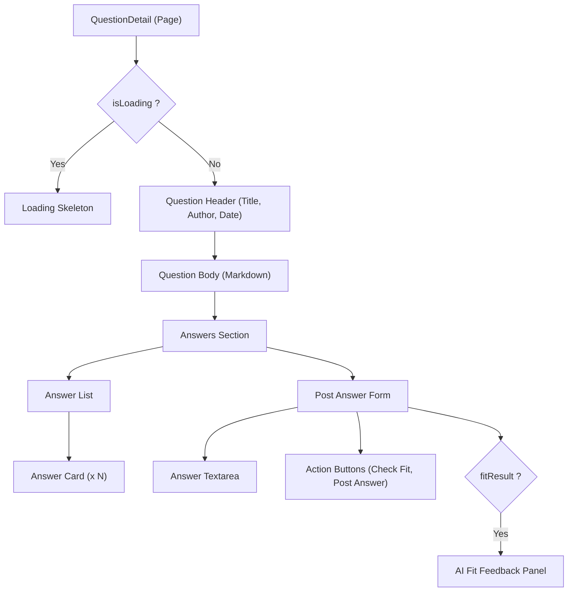

# Task: Question Detail Page & AI Answer Fit

## 1. Page Overview
The Question Detail page displays the full content of a specific question along with all its answers. It also provides a form to post a new answer, including an "AI Answer Fit" feature to evaluate answer relevance before submitting.

- **Path**: `/frontend/src/pages/QuestionDetail/QuestionDetail.jsx`
- **Route**: `/questions/:questionHash`

## 2. Component Hierarchy


## 3. API Integrations
Uses `question.service.js` and `answer.service.js`:
- `getSingleQuestion(questionHash)` -> `GET /api/questions/:questionHash`
- `assessAnswerFit(questionHash, answerText)` -> `POST /api/questions/:questionHash/answer-fit`
- `postAnswer(questionId, content)` -> `POST /api/answers`

## 4. Detailed Logic
1. **Data Fetching**:
   - Extract `questionHash` from URL params.
   - On mount, fetch question and answers via `getSingleQuestion()`.
   - Update `question` and `answers` state.
2. **Post Answer**:
   - Validate answer content (min 20 chars).
   - Prevent users from answering their own question (hide form or show message).
   - Call `postAnswer(question.id, answerText)`.
   - On success, append the new answer to the list locally (or re-fetch) and clear the textarea.
3. **AI Answer Fit**:
   - User clicks "Check Answer Fit".
   - Call `assessAnswerFit(questionHash, answerText)`.
   - Display the returned `level` (strong/partial/weak) and `note` in a styled feedback panel.
4. **UI/UX**:
   - Render question and answer content safely (e.g., using `react-markdown`).
   - Show loading spinners during all API calls.

## 5. Git Workflow & PR Checklist
```bash
git checkout main
git pull origin main
git checkout -b feature/FE-question-detail
# Make your changes
git add .
git commit -m "[FE] Implement Question Detail page and AI Answer Fit"
git push origin feature/FE-question-detail
```

### PR Checklist (include in every PR description)
```markdown
- [ ] Code compiles with no errors (`npm run dev` starts cleanly)
- [ ] Postman tests pass for all endpoints in this task (backend tasks)
- [ ] No console errors in the browser (frontend tasks)
- [ ] All acceptance criteria from the task are met
- [ ] Files match the exact paths listed in the task
```