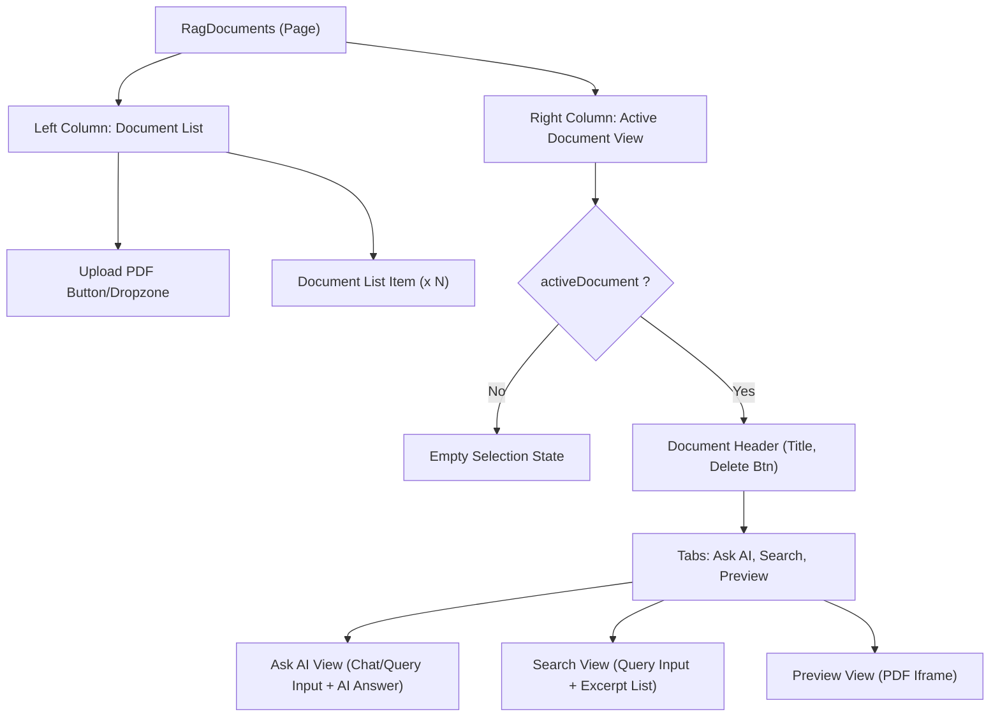

# Task: RAG Documents Page

## 1. Page Overview

The Knowledge Base (RAG) page allows users to upload PDF documents, list their uploaded documents, preview them, and perform semantic search and AI-grounded queries against the document contents.

- **Path**: `/frontend/src/pages/RagDocuments/RagDocuments.jsx`
- **Route**: `/rag-documents`

## 2. Component Hierarchy



## 3. API Integrations

Uses `rag.service.js`:

- `listDocuments()` -> `GET /api/rag/documents`
- `uploadPdf(file)` -> `POST /api/rag/documents`
- `deleteDocument(documentId)` -> `DELETE /api/rag/documents/:documentId`
- `searchInDocument(documentId, query)` -> `GET /api/rag/documents/:documentId/search`
- `queryDocument(documentId, query)` -> `POST /api/rag/documents/:documentId/query`
- `fetchPdfObjectUrl(documentId)` -> `GET /api/rag/documents/:documentId/file`

## 4. Detailed Logic

1. **Document Management**:
   - Fetch and list all documents on mount.
   - Implement PDF upload using a hidden file input or dropzone. Show an uploading state.
   - Allow deleting documents, which removes them from the list locally after API success.
2. **Document Interaction**:
   - Selecting a document from the list opens it in the Right Column.
   - If the document status is `processing`, show a pending state and optionally poll for updates.
   - If `ready`, allow switching between three tabs: Ask AI, Search, and Preview.
3. **Tab Logic**:
   - **Ask AI**: Accepts a query string, calls `queryDocument()`, and displays the AI-generated answer using the `RagAnswerBody` component (for markdown and citation rendering).
   - **Search**: Accepts a query, calls `searchInDocument()`, and lists chunk excerpts and their similarity scores.
   - **Preview**: Calls `fetchPdfObjectUrl()`, creates a blob URL, and renders it in an `iframe`. Must call `URL.revokeObjectURL` on cleanup.

## 5. Git Workflow & PR Checklist

```bash
git checkout main
git pull origin main
git checkout -b feature/FE-rag-documents
# Make your changes
git add .
git commit -m "[FE] Implement RAG Knowledge Base page"
git push origin feature/FE-rag-documents
```

### PR Checklist (include in every PR description)

```markdown
- [ ] Code compiles with no errors (`npm run dev` starts cleanly)
- [ ] Postman tests pass for all endpoints in this task (backend tasks)
- [ ] No console errors in the browser (frontend tasks)
- [ ] All acceptance criteria from the task are met
- [ ] Files match the exact paths listed in the task
```
